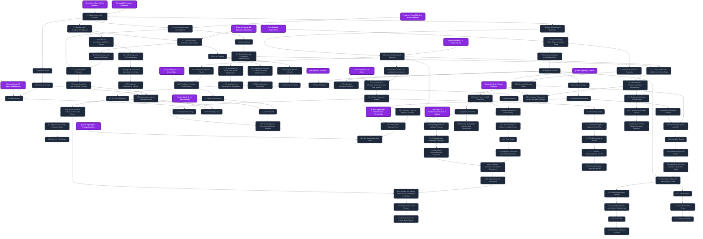

```mermaid
flowchart TD
    classDef completed fill:#FFD700,stroke:#FF8C00,stroke-width:4px,rx:10px,ry:10px,color:#000000,font-weight:bold;
    classDef incomplete fill:#1E293B,stroke:#64748B,stroke-width:3px,stroke-dasharray: 5 5,rx:10px,ry:10px,color:#CBD5E1;
    classDef prereq fill:#8A2BE2,stroke:#4B0082,stroke-width:4px,rx:10px,ry:10px,color:#FFFFFF,font-weight:bold;

    %% PREREQUISITES
    PRE_C1_1["[Precalc] 1.1 Sets of Real Numbers"]:::prereq
    PRE_C1_5["[Precalc] 1.5 Function Arithmetic"]:::prereq
    PRE_C3_4["[Precalc] 3.4 Fundamental Theorem of Algebra"]:::prereq
    PRE_PA_POLY["[Pre-Algebra] Polynomials"]:::prereq
    PRE_PA_FRAC["[Pre-Algebra] Fractions"]:::prereq
    PRE_LA2_3["[Linear Algebra] 2.3 Matrix Multiplication"]:::prereq
    PRE_LA1_4["[Linear Algebra] 1.4 Fields"]:::prereq
    PRE_LA1_5["[Linear Algebra] 1.5 Vector Spaces"]:::prereq
    PRE_LA3_2["[Linear Algebra] 3.2 Bases"]:::prereq
    PRE_LA2_1["[Linear Algebra] 2.1 Linear Maps"]:::prereq
    PRE_LA6_1["[Linear Algebra] 6.1 Determinants"]:::prereq
    PRE_LA6_3["[Linear Algebra] 6.3 Characteristic Polynomials"]:::prereq
    PRE_LA3_7["[Linear Algebra] 3.7 Triangularization"]:::prereq
    PRE_LA4_1["[Linear Algebra] 4.1 Inner Products"]:::prereq
    PRE_HTPI4_6["[How to Prove It] 4.6 Equivalence Relations"]:::prereq
    PRE_HTPI5_2["[How to Prove It] 5.2 One-to-one and Onto"]:::prereq

    %% AA CHAPTER 1
    AA1_1[1.1 Basic Axioms and Examples]:::incomplete
    AA1_2[1.2 Dihedral Groups]:::incomplete
    AA1_3[1.3 Symmetric Groups]:::incomplete
    AA1_4[1.4 Matrix Groups]:::incomplete
    AA1_5[1.5 The Quaternion Group]:::incomplete
    AA1_6[1.6 Homomorphisms and Isomorphisms]:::incomplete
    AA1_7[1.7 Group Actions]:::incomplete
    PRE_C1_1 --> AA1_1
    PRE_C1_5 --> AA1_1
    AA1_1 --> AA1_2 & AA1_6 & AA2_1 & AA7_1
    AA1_2 --> AA1_3
    PRE_LA2_3 --> AA1_4
    AA1_3 --> AA1_4 & AA3_5
    AA1_4 --> AA1_5
    PRE_HTPI5_2 --> AA1_6
    AA1_6 --> AA1_7 & AA3_3

    %% AA CHAPTER 2
    AA2_1[2.1 Definition and Examples of Subgroups]:::incomplete
    AA2_2[2.2 Centralizers, Normalizers, Stabilizers, Kernels]:::incomplete
    AA2_3[2.3 Cyclic Groups and Cyclic Subgroups]:::incomplete
    AA2_4[2.4 Subgroups Generated by Subsets of a Group]:::incomplete
    AA2_5[2.5 The Lattice of Subgroups of a Group]:::incomplete
    AA2_1 --> AA2_2 & AA3_1
    AA2_2 --> AA2_3
    AA2_3 --> AA2_4
    AA2_4 --> AA2_5

    %% AA CHAPTER 3
    AA3_1[3.1 Quotient Groups: Definitions and Examples]:::incomplete
    AA3_2[3.2 More on Cosets and Lagrange's Theorem]:::incomplete
    AA3_3[3.3 The Isomorphism Theorems]:::incomplete
    AA3_4[3.4 Composition Series and the Holder Program]:::incomplete
    AA3_5[3.5 Transpositions and the Alternating Group]:::incomplete
    PRE_HTPI4_6 --> AA3_1
    AA3_1 --> AA3_2 & AA5_1
    AA3_2 --> AA3_3
    AA3_3 --> AA3_4
    AA3_4 --> AA3_5

    %% AA CHAPTER 4
    AA4_1[4.1 Group Actions and Permutation Representations]:::incomplete
    AA4_2[4.2 Groups Acting on Themselves by Left Multiplication]:::incomplete
    AA4_3[4.3 Groups Acting on Themselves by Conjugation]:::incomplete
    AA4_4[4.4 Automorphisms]:::incomplete
    AA4_5[4.5 The Sylow Theorems]:::incomplete
    AA4_6[4.6 The Simplicity of An]:::incomplete
    AA1_7 --> AA4_1
    AA4_1 --> AA4_2 & AA18_1
    AA4_2 --> AA4_3
    AA4_3 --> AA4_4 & AA4_5
    AA3_5 --> AA4_6
    AA4_5 --> AA4_6 & AA6_1

    %% AA CHAPTER 5
    AA5_1[5.1 Direct Products]:::incomplete
    AA5_2[5.2 Fundamental Theorem of Finitely Generated Abelian Groups]:::incomplete
    AA5_3[5.3 Table of Groups of Small Order]:::incomplete
    AA5_4[5.4 Recognizing Direct Products]:::incomplete
    AA5_5[5.5 Semidirect Products]:::incomplete
    AA5_1 --> AA5_2 & AA5_4
    AA5_2 --> AA5_3
    AA5_4 --> AA5_5

    %% AA CHAPTER 6
    AA6_1[6.1 p-groups, Nilpotent Groups, and Solvable Groups]:::incomplete
    AA6_2[6.2 Applications in Groups of Medium Order]:::incomplete
    AA6_3[6.3 A Word on Free Groups]:::incomplete
    AA6_1 --> AA6_2 & AA14_7
    AA6_2 --> AA6_3

    %% AA CHAPTER 7
    AA7_1[7.1 Basic Definitions and Examples]:::incomplete
    AA7_2[7.2 Polynomial Rings, Matrix Rings, and Group Rings]:::incomplete
    AA7_3[7.3 Ring Homomorphisms and Quotient Rings]:::incomplete
    AA7_4[7.4 Properties of Ideals]:::incomplete
    AA7_5[7.5 Rings of Fractions]:::incomplete
    AA7_6[7.6 The Chinese Remainder Theorem]:::incomplete
    PRE_PA_POLY --> AA7_2
    AA7_1 --> AA7_2 & AA10_1
    AA7_2 --> AA7_3 & AA9_1
    AA7_3 --> AA7_4
    PRE_PA_FRAC --> AA7_5
    AA7_4 --> AA7_5 & AA7_6 & AA8_1 & AA15_1

    %% AA CHAPTER 8
    AA8_1[8.1 Euclidean Domains]:::incomplete
    AA8_2[8.2 Principal Ideal Domains]:::incomplete
    AA8_3[8.3 Unique Factorization Domains]:::incomplete
    AA8_1 --> AA8_2
    AA8_2 --> AA8_3 & AA12_1

    %% AA CHAPTER 9
    AA9_1[9.1 Definitions and Basic Properties]:::incomplete
    AA9_2[9.2 Polynomial Rings over Fields I]:::incomplete
    AA9_3[9.3 Polynomial Rings that are UFDs]:::incomplete
    AA9_4[9.4 Irreducibility Criteria]:::incomplete
    AA9_5[9.5 Polynomial Rings over Fields II]:::incomplete
    AA9_6[9.6 Polynomials in Several Variables and Grobner Bases]:::incomplete
    PRE_LA1_4 --> AA9_2
    AA9_1 --> AA9_2
    AA8_3 --> AA9_3
    AA9_2 --> AA9_3 & AA13_1
    AA9_3 --> AA9_4
    AA9_4 --> AA9_5
    AA9_5 --> AA9_6
    AA9_6 --> AA15_1

    %% AA CHAPTER 10
    AA10_1[10.1 Basic Definitions and Examples]:::incomplete
    AA10_2[10.2 Quotient Modules and Module Homomorphisms]:::incomplete
    AA10_3[10.3 Generation of Modules, Direct Sums, and Free Modules]:::incomplete
    AA10_4[10.4 Tensor Products of Modules]:::incomplete
    AA10_5[10.5 Exact Sequences]:::incomplete
    PRE_LA1_5 --> AA10_1
    AA10_1 --> AA10_2 & AA11_1 & AA12_1 & AA18_1
    PRE_LA3_2 --> AA10_3
    AA10_2 --> AA10_3
    AA10_3 --> AA10_4
    AA10_4 --> AA10_5 & AA11_5
    AA10_5 --> AA17_1

    %% AA CHAPTER 11
    AA11_1[11.1 Definitions and Basic Theory]:::incomplete
    AA11_2[11.2 The Matrix of a Linear Transformation]:::incomplete
    AA11_3[11.3 Dual Vector Spaces]:::incomplete
    AA11_4[11.4 Determinants]:::incomplete
    AA11_5[11.5 Tensor Algebras, Symmetric and Exterior Algebras]:::incomplete
    PRE_LA2_1 --> AA11_2
    AA11_1 --> AA11_2
    AA11_2 --> AA11_3
    PRE_LA6_1 --> AA11_4
    AA11_3 --> AA11_4
    AA11_4 --> AA11_5

    %% AA CHAPTER 12
    AA12_1[12.1 The Basic Theory of Modules over PIDs]:::incomplete
    AA12_2[12.2 The Rational Canonical Form]:::incomplete
    AA12_3[12.3 The Jordan Canonical Form]:::incomplete
    PRE_LA6_3 --> AA12_2
    AA12_1 --> AA12_2
    PRE_LA3_7 --> AA12_3
    AA12_2 --> AA12_3

    %% AA CHAPTER 13
    AA13_1[13.1 Basic Theory of Field Extensions]:::incomplete
    AA13_2[13.2 Algebraic Extensions]:::incomplete
    AA13_3[13.3 Classical Straightedge and Compass Constructions]:::incomplete
    AA13_4[13.4 Splitting Fields and Algebraic Closures]:::incomplete
    AA13_5[13.5 Separable and Inseparable Extensions]:::incomplete
    AA13_6[13.6 Cyclotomic Polynomials and Extensions]:::incomplete
    AA13_1 --> AA13_2 & AA14_1
    AA13_2 --> AA13_3 & AA13_4
    PRE_C3_4 --> AA13_4
    AA13_4 --> AA13_5
    AA13_5 --> AA13_6
    AA13_6 --> AA14_5

    %% AA CHAPTER 14
    AA14_1[14.1 Basic Definitions of Galois Theory]:::incomplete
    AA14_2[14.2 The Fundamental Theorem of Galois Theory]:::incomplete
    AA14_3[14.3 Finite Fields]:::incomplete
    AA14_4[14.4 Composite Extensions and Simple Extensions]:::incomplete
    AA14_5[14.5 Cyclotomic Extensions and Abelian Extensions]:::incomplete
    AA14_6[14.6 Galois Groups of Polynomials]:::incomplete
    AA14_7[14.7 Solvable and Radical Extensions: Insolvability of the Quintic]:::incomplete
    AA14_8[14.8 Computation of Galois Groups]:::incomplete
    AA14_9[14.9 Transcendental and Infinite Galois Groups]:::incomplete
    AA4_4 --> AA14_1
    AA14_1 --> AA14_2
    AA14_2 --> AA14_3
    AA14_3 --> AA14_4
    AA14_4 --> AA14_5
    AA14_5 --> AA14_6
    AA14_6 --> AA14_7
    AA14_7 --> AA14_8
    AA14_8 --> AA14_9

    %% AA CHAPTER 15
    AA15_1[15.1 Noetherian Rings and Affine Algebraic Sets]:::incomplete
    AA15_2[15.2 Radicals and Affine Varieties]:::incomplete
    AA15_3[15.3 Integral Extensions and Hilbert's Nullstellensatz]:::incomplete
    AA15_4[15.4 Localization]:::incomplete
    AA15_5[15.5 The Prime Spectrum of a Ring]:::incomplete
    AA15_1 --> AA15_2 & AA16_1
    AA15_2 --> AA15_3
    AA15_3 --> AA15_4
    AA15_4 --> AA15_5

    %% AA CHAPTER 16
    AA16_1[16.1 Artinian Rings]:::incomplete
    AA16_2[16.2 Discrete Valuation Rings]:::incomplete
    AA16_3[16.3 Dedekind Domains]:::incomplete
    AA16_1 --> AA16_2
    AA16_2 --> AA16_3

    %% AA CHAPTER 17
    AA17_1[17.1 Intro to Homological Algebra: Ext and Tor]:::incomplete
    AA17_2[17.2 The Cohomology of Groups]:::incomplete
    AA17_3[17.3 Crossed Homomorphisms and H1]:::incomplete
    AA17_4[17.4 Group Extensions, Factor Sets and H2]:::incomplete
    AA17_1 --> AA17_2
    AA17_2 --> AA17_3
    AA17_3 --> AA17_4

    %% AA CHAPTER 18
    AA18_1[18.1 Linear Actions and Modules over Group Rings]:::incomplete
    AA18_2[18.2 Wedderburn's Theorem and Some Consequences]:::incomplete
    AA18_3[18.3 Character Theory and the Orthogonality Relations]:::incomplete
    AA18_1 --> AA18_2
    PRE_LA4_1 --> AA18_3
    AA18_2 --> AA18_3 & AA19_1

    %% AA CHAPTER 19
    AA19_1[19.1 Characters of Groups of Small Order]:::incomplete
    AA19_2[19.2 Theorems of Burnside and Hall]:::incomplete
    AA19_3[19.3 Introduction to the Theory of Induced Characters]:::incomplete
    AA19_1 --> AA19_2
    AA19_2 --> AA19_3
```