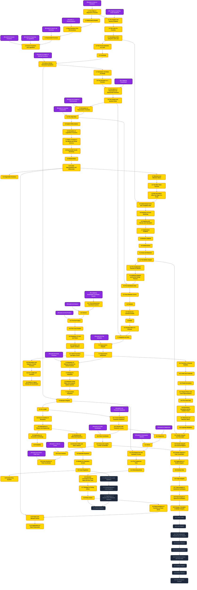

```mermaid
flowchart TD
    classDef completed fill:#FFD700,stroke:#FF8C00,stroke-width:4px,rx:10px,ry:10px,color:#000000,font-weight:bold;
    classDef incomplete fill:#1E293B,stroke:#64748B,stroke-width:3px,stroke-dasharray: 5 5,rx:10px,ry:10px,color:#CBD5E1;
    classDef prereq fill:#8A2BE2,stroke:#4B0082,stroke-width:4px,rx:10px,ry:10px,color:#FFFFFF,font-weight:bold;

    %% PREREQUISITES
    PRE_PA_LINE["[Pre-Algebra] Graphing Linear Equations"]:::prereq
    PRE_PA_POLY["[Pre-Algebra] Polynomials"]:::prereq
    PRE_PA_COORD["[Pre-Algebra] Rectangular Coordinate System"]:::prereq
    PRE_C1_3["[Precalc] 1.3 Intro to Functions"]:::prereq
    PRE_C1_7["[Precalc] 1.7 Transformations"]:::prereq
    PRE_C4_2["[Precalc] 4.2 Graphs of Rational Functions"]:::prereq
    PRE_C5_1["[Precalc] 5.1 Function Composition"]:::prereq
    PRE_C5_2["[Precalc] 5.2 Inverse Functions"]:::prereq
    PRE_C6_1["[Precalc] 6.1 Exp & Log Functions"]:::prereq
    PRE_C6_2["[Precalc] 6.2 Properties of Logarithms"]:::prereq
    PRE_C7_1["[Precalc] 7.1 Intro to Conics"]:::prereq
    PRE_C8_6["[Precalc] 8.6 Partial Fractions"]:::prereq
    PRE_C9_1["[Precalc] 9.1 Sequences"]:::prereq
    PRE_C9_2["[Precalc] 9.2 Summation Notation"]:::prereq
    PRE_C10_4["[Precalc] 10.4 Trig Identities"]:::prereq
    PRE_C10_5["[Precalc] 10.5 Graphs of Trig Functions"]:::prereq
    PRE_C11_4["[Precalc] 11.4 Polar Coordinates"]:::prereq
    PRE_C11_6["[Precalc] 11.6 Conics: Polar Form"]:::prereq
    PRE_C11_8["[Precalc] 11.8 Vectors"]:::prereq
    PRE_C11_9["[Precalc] 11.9 Dot Product"]:::prereq
    PRE_C11_10["[Precalc] 11.10 Parametric Equations"]:::prereq

    %% CALCULUS CHAPTER 1
    CALC1_1[1.1 Four Ways to Represent a Function]:::completed
    CALC1_2[1.2 Mathematical Models]:::completed
    CALC1_3[1.3 New Functions from Old Functions]:::completed
    CALC1_4[1.4 Exponential Functions]:::completed
    CALC1_5[1.5 Inverse Functions and Logarithms]:::completed
    PRE_C1_3 --> CALC1_1
    CALC1_1 --> CALC1_2 & CALC2_1
    PRE_C1_7 --> CALC1_3
    CALC1_2 --> CALC1_3
    PRE_C6_1 --> CALC1_4
    CALC1_3 --> CALC1_4
    PRE_C5_2 --> CALC1_5
    PRE_C6_2 --> CALC1_5
    CALC1_4 --> CALC1_5

    %% CALCULUS CHAPTER 2
    CALC2_1[2.1 The Tangent and Velocity Problems]:::completed
    CALC2_2[2.2 The Limit of a Function]:::completed
    CALC2_3[2.3 Calculating Limits Using the Limit Laws]:::completed
    CALC2_4[2.4 The Precise Definition of a Limit]:::completed
    CALC2_5[2.5 Continuity]:::completed
    CALC2_6[2.6 Limits at Infinity; Horizontal Asymptotes]:::completed
    CALC2_7[2.7 Derivatives and Rates of Change]:::completed
    CALC2_8[2.8 The Derivative as a Function]:::completed
    PRE_PA_LINE --> CALC2_1
    CALC2_1 --> CALC2_2
    CALC2_2 --> CALC2_3
    CALC2_3 --> CALC2_4 & CALC4_4
    CALC2_4 --> CALC2_5
    PRE_C4_2 --> CALC2_6
    CALC2_5 --> CALC2_6
    CALC2_6 --> CALC2_7 & CALC7_8
    CALC2_7 --> CALC2_8
    CALC2_8 --> CALC3_1

    %% CALCULUS CHAPTER 3
    CALC3_1[3.1 Derivatives of Polynomials and Exponential Functions]:::completed
    CALC3_2[3.2 The Product and Quotient Rules]:::completed
    CALC3_3[3.3 Derivatives of Trigonometric Functions]:::completed
    CALC3_4[3.4 The Chain Rule]:::completed
    CALC3_5[3.5 Implicit Differentiation]:::completed
    CALC3_6[3.6 Derivatives of Logarithmic Functions]:::completed
    CALC3_7[3.7 Rates of Change in the Natural and Social Sciences]:::completed
    CALC3_8[3.8 Exponential Growth and Decay]:::completed
    CALC3_9[3.9 Related Rates]:::completed
    CALC3_10[3.10 Linear Approximations and Differentials]:::completed
    CALC3_11[3.11 Hyperbolic Functions]:::completed
    PRE_PA_POLY --> CALC3_1
    CALC3_1 --> CALC3_2
    PRE_C10_5 --> CALC3_3
    CALC3_2 --> CALC3_3 & CALC7_1
    PRE_C5_1 --> CALC3_4
    CALC3_3 --> CALC3_4
    CALC3_4 --> CALC3_5 & CALC5_5
    CALC3_5 --> CALC3_6
    CALC3_6 --> CALC3_7
    CALC3_7 --> CALC3_8
    CALC3_8 --> CALC3_9
    CALC3_9 --> CALC3_10
    CALC3_10 --> CALC3_11 & CALC4_1 & CALC11_10

    %% CALCULUS CHAPTER 4
    CALC4_1[4.1 Maximum and Minimum Values]:::completed
    CALC4_2[4.2 The Mean Value Theorem]:::completed
    CALC4_3[4.3 How Derivatives Affect the Shape of a Graph]:::completed
    CALC4_4[4.4 Indeterminate Forms and L'Hospital's Rule]:::completed
    CALC4_5[4.5 Summary of Curve Sketching]:::completed
    CALC4_6[4.6 Graphing with Calculus and Calculators]:::completed
    CALC4_7[4.7 Optimization Problems]:::completed
    CALC4_8[4.8 Newton's Method]:::completed
    CALC4_9[4.9 Antiderivatives]:::completed
    CALC4_1 --> CALC4_2
    CALC4_2 --> CALC4_3
    CALC4_3 --> CALC4_4
    CALC4_4 --> CALC4_5
    CALC4_5 --> CALC4_6
    CALC4_6 --> CALC4_7
    CALC4_7 --> CALC4_8
    CALC4_8 --> CALC4_9
    CALC4_9 --> CALC5_1

    %% CALCULUS CHAPTER 5
    CALC5_1[5.1 Areas and Distances]:::completed
    CALC5_2[5.2 The Definite Integral]:::completed
    CALC5_3[5.3 The Fundamental Theorem of Calculus]:::completed
    CALC5_4[5.4 Indefinite Integrals and the Net Change Theorem]:::completed
    CALC5_5[5.5 The Substitution Rule]:::completed
    CALC5_1 --> CALC5_2
    CALC5_2 --> CALC5_3 & CALC15_1
    CALC5_3 --> CALC5_4
    CALC5_4 --> CALC5_5
    CALC5_5 --> CALC6_1

    %% CALCULUS CHAPTER 6
    CALC6_1[6.1 Areas Between Curves]:::completed
    CALC6_2[6.2 Volumes]:::completed
    CALC6_3[6.3 Volumes by Cylindrical Shells]:::completed
    CALC6_4[6.4 Work]:::completed
    CALC6_5[6.5 Average Value of a Function]:::completed
    CALC6_1 --> CALC6_2
    CALC6_2 --> CALC6_3
    CALC6_3 --> CALC6_4
    CALC6_4 --> CALC6_5
    CALC6_5 --> CALC7_1

    %% CALCULUS CHAPTER 7
    CALC7_1[7.1 Integration by Parts]:::completed
    CALC7_2[7.2 Trigonometric Integrals]:::completed
    CALC7_3[7.3 Trigonometric Substitution]:::completed
    CALC7_4[7.4 Integration of Rational Functions by Partial Fractions]:::completed
    CALC7_5[7.5 Strategy for Integration]:::completed
    CALC7_6[7.6 Integration Using Tables and Computer Algebra Systems]:::completed
    CALC7_7[7.7 Approximate Integration]:::completed
    CALC7_8[7.8 Improper Integrals]:::completed
    PRE_C10_4 --> CALC7_2
    CALC7_1 --> CALC7_2
    CALC7_2 --> CALC7_3
    PRE_C8_6 --> CALC7_4
    CALC7_3 --> CALC7_4
    CALC7_4 --> CALC7_5
    CALC7_5 --> CALC7_6
    CALC7_6 --> CALC7_7
    CALC7_7 --> CALC7_8
    CALC7_8 --> CALC8_1 & CALC11_3

    %% CALCULUS CHAPTER 8
    CALC8_1[8.1 Arc Length]:::completed
    CALC8_2[8.2 Area of a Surface of Revolution]:::completed
    CALC8_3[8.3 Applications to Physics and Engineering]:::completed
    CALC8_4[8.4 Applications to Economics and Biology]:::completed
    CALC8_5[8.5 Probability]:::completed
    CALC8_1 --> CALC8_2 & CALC10_1
    CALC8_2 --> CALC8_3
    CALC8_3 --> CALC8_4 & CALC9_1
    CALC8_4 --> CALC8_5

    %% CALCULUS CHAPTER 9
    CALC9_1[9.1 Modeling with Differential Equations]:::completed
    CALC9_2[9.2 Direction Fields and Euler's Method]:::completed
    CALC9_3[9.3 Separable Equations]:::completed
    CALC9_4[9.4 Models for Population Growth]:::completed
    CALC9_5[9.5 Linear Equations]:::completed
    CALC9_6[9.6 Predator-Prey Systems]:::completed
    CALC9_1 --> CALC9_2
    CALC9_2 --> CALC9_3
    CALC9_3 --> CALC9_4
    CALC9_4 --> CALC9_5
    CALC9_5 --> CALC9_6 & CALC17_1

    %% CALCULUS CHAPTER 10
    CALC10_1[10.1 Curves Defined by Parametric Equations]:::completed
    CALC10_2[10.2 Calculus with Parametric Curves]:::completed
    CALC10_3[10.3 Polar Coordinates]:::completed
    CALC10_4[10.4 Areas and Lengths in Polar Coordinates]:::completed
    CALC10_5[10.5 Conic Sections]:::completed
    CALC10_6[10.6 Conic Sections in Polar Coordinates]:::completed
    PRE_C11_10 --> CALC10_1
    CALC10_1 --> CALC10_2
    PRE_C11_4 --> CALC10_3
    CALC10_2 --> CALC10_3 & CALC11_1
    CALC10_3 --> CALC10_4
    PRE_C7_1 --> CALC10_5
    CALC10_4 --> CALC10_5 & CALC15_3
    PRE_C11_6 --> CALC10_6
    CALC10_5 --> CALC10_6

    %% CALCULUS CHAPTER 11
    CALC11_1[11.1 Sequences]:::completed
    CALC11_2[11.2 Series]:::completed
    CALC11_3[11.3 The Integral Test and Estimates of Sums]:::completed
    CALC11_4[11.4 The Comparison Tests]:::completed
    CALC11_5[11.5 Alternating Series]:::completed
    CALC11_6[11.6 Absolute Convergence and the Ratio and Root Tests]:::completed
    CALC11_7[11.7 Strategy for Testing Series]:::completed
    CALC11_8[11.8 Power Series]:::completed
    CALC11_9[11.9 Representations of Functions as Power Series]:::completed
    CALC11_10[11.10 Taylor and Maclaurin Series]:::completed
    CALC11_11[11.11 Applications of Taylor Polynomials]:::completed
    PRE_C9_1 --> CALC11_1
    PRE_C9_2 --> CALC11_2
    CALC11_1 --> CALC11_2
    CALC11_2 --> CALC11_3
    CALC11_3 --> CALC11_4
    CALC11_4 --> CALC11_5
    CALC11_5 --> CALC11_6
    CALC11_6 --> CALC11_7
    CALC11_7 --> CALC11_8
    CALC11_8 --> CALC11_9 & CALC17_4
    CALC11_9 --> CALC11_10
    CALC11_10 --> CALC11_11

    %% CALCULUS CHAPTER 12
    CALC12_1[12.1 Three-Dimensional Coordinate Systems]:::completed
    CALC12_2[12.2 Vectors]:::completed
    CALC12_3[12.3 The Dot Product]:::completed
    CALC12_4[12.4 The Cross Product]:::completed
    CALC12_5[12.5 Equations of Lines and Planes]:::completed
    CALC12_6[12.6 Cylinders and Quadric Surfaces]:::completed
    PRE_PA_COORD --> CALC12_1
    PRE_C11_8 --> CALC12_2
    CALC12_1 --> CALC12_2
    PRE_C11_9 --> CALC12_3
    CALC12_2 --> CALC12_3
    CALC12_3 --> CALC12_4
    CALC12_4 --> CALC12_5
    CALC12_5 --> CALC12_6
    CALC12_6 --> CALC13_1

    %% CALCULUS CHAPTER 13
    CALC13_1[13.1 Vector Functions and Space Curves]:::completed
    CALC13_2[13.2 Derivatives and Integrals of Vector Functions]:::completed
    CALC13_3[13.3 Arc Length and Curvature]:::completed
    CALC13_4[13.4 Motion in Space: Velocity and Acceleration]:::completed
    CALC13_1 --> CALC13_2 & CALC14_1
    CALC13_2 --> CALC13_3
    CALC13_3 --> CALC13_4

    %% CALCULUS CHAPTER 14
    CALC14_1[14.1 Functions of Several Variables]:::completed
    CALC14_2[14.2 Limits and Continuity]:::completed
    CALC14_3[14.3 Partial Derivatives]:::completed
    CALC14_4[14.4 Tangent Planes and Linear Approximations]:::completed
    CALC14_5[14.5 The Chain Rule]:::completed
    CALC14_6[14.6 Directional Derivatives and the Gradient Vector]:::completed
    CALC14_7[14.7 Maximum and Minimum Values]:::completed
    CALC14_8[14.8 Lagrange Multipliers]:::completed
    CALC14_1 --> CALC14_2
    CALC14_2 --> CALC14_3
    CALC14_3 --> CALC14_4
    CALC14_4 --> CALC14_5
    CALC14_5 --> CALC14_6
    CALC14_6 --> CALC14_7
    CALC14_7 --> CALC14_8
    CALC14_8 --> CALC15_1

    %% CALCULUS CHAPTER 15
    CALC15_1[15.1 Double Integrals over Rectangles]:::completed
    CALC15_2[15.2 Double Integrals over General Regions]:::completed
    CALC15_3[15.3 Double Integrals in Polar Coordinates]:::completed
    CALC15_4[15.4 Applications of Double Integrals]:::completed
    CALC15_5[15.5 Surface Area]:::completed
    CALC15_6[15.6 Triple Integrals]:::completed
    CALC15_7[15.7 Triple Integrals in Cylindrical Coordinates]:::completed
    CALC15_8[15.8 Triple Integrals in Spherical Coordinates]:::completed
    CALC15_9[15.9 Change of Variables in Multiple Integrals]:::completed
    CALC15_1 --> CALC15_2
    CALC15_2 --> CALC15_3
    CALC15_3 --> CALC15_4
    CALC15_4 --> CALC15_5
    CALC15_5 --> CALC15_6
    CALC15_6 --> CALC15_7
    CALC15_7 --> CALC15_8
    CALC15_8 --> CALC15_9
    CALC15_9 --> CALC16_1

    %% CALCULUS CHAPTER 16 (INCOMPLETE)
    CALC16_1[16.1 Vector Fields]:::incomplete
    CALC16_2[16.2 Line Integrals]:::incomplete
    CALC16_3[16.3 The Fundamental Theorem for Line Integrals]:::incomplete
    CALC16_4[16.4 Green's Theorem]:::incomplete
    CALC16_5[16.5 Curl and Divergence]:::incomplete
    CALC16_6[16.6 Parametric Surfaces and Their Areas]:::incomplete
    CALC16_7[16.7 Surface Integrals]:::incomplete
    CALC16_8[16.8 Stokes' Theorem]:::incomplete
    CALC16_9[16.9 The Divergence Theorem]:::incomplete
    CALC16_1 --> CALC16_2
    CALC16_2 --> CALC16_3
    CALC16_3 --> CALC16_4
    CALC16_4 --> CALC16_5
    CALC16_5 --> CALC16_6
    CALC16_6 --> CALC16_7
    CALC16_7 --> CALC16_8
    CALC16_8 --> CALC16_9

    %% CALCULUS CHAPTER 17 (INCOMPLETE)
    CALC17_1[17.1 Second-Order Linear Equations]:::incomplete
    CALC17_2[17.2 Nonhomogeneous Linear Equations]:::incomplete
    CALC17_3[17.3 Applications of Second-Order Differential Equations]:::incomplete
    CALC17_4[17.4 Series Solutions]:::incomplete
    CALC17_1 --> CALC17_2
    CALC17_2 --> CALC17_3
    CALC17_3 --> CALC17_4
```