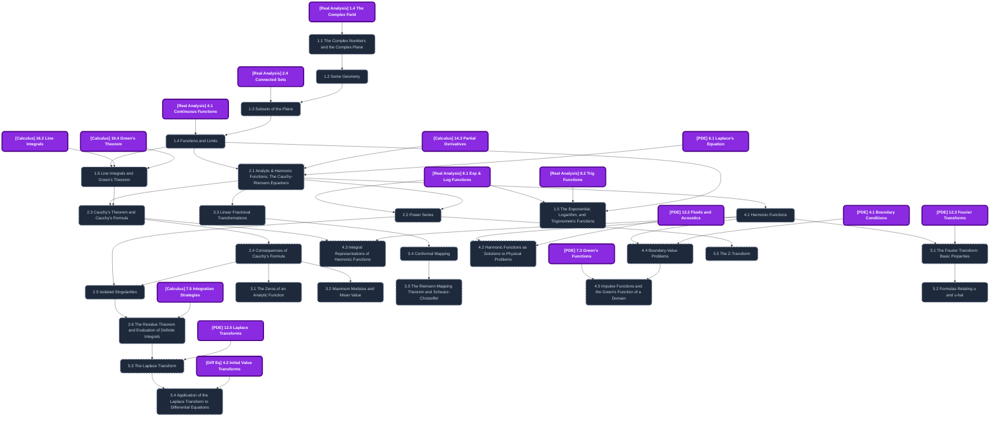

```mermaid
flowchart TD
    classDef completed fill:#FFD700,stroke:#FF8C00,stroke-width:4px,rx:10px,ry:10px,color:#000000,font-weight:bold;
    classDef incomplete fill:#1E293B,stroke:#64748B,stroke-width:3px,stroke-dasharray: 5 5,rx:10px,ry:10px,color:#CBD5E1;
    classDef prereq fill:#8A2BE2,stroke:#4B0082,stroke-width:4px,rx:10px,ry:10px,color:#FFFFFF,font-weight:bold;

    %% PREREQUISITES
    PRE_RA1_4["[Real Analysis] 1.4 The Complex Field"]:::prereq
    PRE_RA2_4["[Real Analysis] 2.4 Connected Sets"]:::prereq
    PRE_RA4_1["[Real Analysis] 4.1 Continuous Functions"]:::prereq
    PRE_RA8_1["[Real Analysis] 8.1 Exp & Log Functions"]:::prereq
    PRE_RA8_2["[Real Analysis] 8.2 Trig Functions"]:::prereq
    PRE_CALC16_2["[Calculus] 16.2 Line Integrals"]:::prereq
    PRE_CALC16_4["[Calculus] 16.4 Green's Theorem"]:::prereq
    PRE_CALC14_3["[Calculus] 14.3 Partial Derivatives"]:::prereq
    PRE_CALC7_5["[Calculus] 7.5 Integration Strategies"]:::prereq
    PRE_PDE6_1["[PDE] 6.1 Laplace's Equation"]:::prereq
    PRE_PDE13_2["[PDE] 13.2 Fluids and Acoustics"]:::prereq
    PRE_PDE4_1["[PDE] 4.1 Boundary Conditions"]:::prereq
    PRE_PDE7_3["[PDE] 7.3 Green's Functions"]:::prereq
    PRE_PDE12_3["[PDE] 12.3 Fourier Transforms"]:::prereq
    PRE_PDE12_5["[PDE] 12.5 Laplace Transforms"]:::prereq
    PRE_DE4_2["[Diff Eq] 4.2 Initial Value Transforms"]:::prereq

    %% CV CHAPTER 1
    CV1_1[1.1 The Complex Numbers and the Complex Plane]:::incomplete
    CV1_2[1.2 Some Geometry]:::incomplete
    CV1_3[1.3 Subsets of the Plane]:::incomplete
    CV1_4[1.4 Functions and Limits]:::incomplete
    CV1_5[1.5 The Exponential, Logarithm, and Trigonometric Functions]:::incomplete
    CV1_6[1.6 Line Integrals and Green's Theorem]:::incomplete
    PRE_RA1_4 --> CV1_1
    CV1_1 --> CV1_2
    PRE_RA2_4 --> CV1_3
    CV1_2 --> CV1_3
    PRE_RA4_1 --> CV1_4
    CV1_3 --> CV1_4
    PRE_RA8_1 --> CV1_5
    PRE_RA8_2 --> CV1_5
    CV1_4 --> CV1_5 & CV1_6 & CV2_1
    PRE_CALC16_2 --> CV1_6
    PRE_CALC16_4 --> CV1_6

    %% CV CHAPTER 2
    CV2_1[2.1 Analytic & Harmonic Functions; The Cauchy-Riemann Equations]:::incomplete
    CV2_2[2.2 Power Series]:::incomplete
    CV2_3[2.3 Cauchy's Theorem and Cauchy's Formula]:::incomplete
    CV2_4[2.4 Consequences of Cauchy's Formula]:::incomplete
    CV2_5[2.5 Isolated Singularities]:::incomplete
    CV2_6[2.6 The Residue Theorem and Evaluation of Definite Integrals]:::incomplete
    PRE_CALC14_3 --> CV2_1
    PRE_PDE6_1 --> CV2_1
    PRE_RA8_1 --> CV2_2
    CV2_1 --> CV2_2 & CV2_3 & CV3_3 & CV4_1
    CV1_6 --> CV2_3
    CV2_3 --> CV2_4 & CV4_3
    CV2_2 --> CV2_5
    CV2_4 --> CV2_5 & CV3_1 & CV3_2
    CV2_5 --> CV2_6
    PRE_CALC7_5 --> CV2_6
    CV2_6 --> CV5_3

    %% CV CHAPTER 3
    CV3_1[3.1 The Zeros of an Analytic Function]:::incomplete
    CV3_2[3.2 Maximum Modulus and Mean Value]:::incomplete
    CV3_3[3.3 Linear Fractional Transformations]:::incomplete
    CV3_4[3.4 Conformal Mapping]:::incomplete
    CV3_5[3.5 The Riemann Mapping Theorem and Schwarz-Christoffel]:::incomplete
    CV3_3 --> CV3_4
    CV3_4 --> CV3_5

    %% CV CHAPTER 4
    CV4_1[4.1 Harmonic Functions]:::incomplete
    CV4_2[4.2 Harmonic Functions as Solutions to Physical Problems]:::incomplete
    CV4_3[4.3 Integral Representations of Harmonic Functions]:::incomplete
    CV4_4[4.4 Boundary-Value Problems]:::incomplete
    CV4_5[4.5 Impulse Functions and the Green's Function of a Domain]:::incomplete
    CV4_1 --> CV4_2 & CV4_3 & CV4_4 & CV5_1
    PRE_PDE13_2 --> CV4_2
    PRE_PDE4_1 --> CV4_4
    PRE_PDE7_3 --> CV4_5
    CV4_4 --> CV4_5

    %% CV CHAPTER 5
    CV5_1[5.1 The Fourier Transform: Basic Properties]:::incomplete
    CV5_2[5.2 Formulas Relating u and u-hat]:::incomplete
    CV5_3[5.3 The Laplace Transform]:::incomplete
    CV5_4[5.4 Application of the Laplace Transform to Differential Equations]:::incomplete
    CV5_5[5.5 The Z-Transform]:::incomplete
    PRE_PDE12_3 --> CV5_1
    CV5_1 --> CV5_2
    PRE_PDE12_5 --> CV5_3
    CV5_3 --> CV5_4
    PRE_DE4_2 --> CV5_4
    CV2_2 --> CV5_5
```