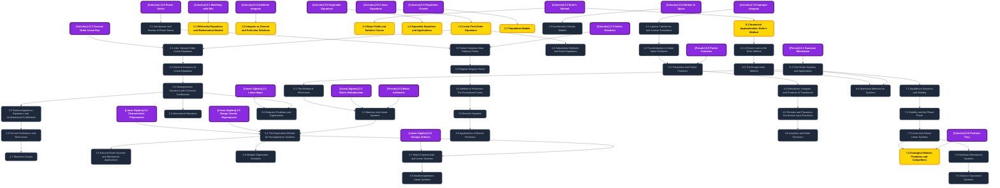

```mermaid
flowchart TD
    classDef completed fill:#FFD700,stroke:#FF8C00,stroke-width:4px,rx:10px,ry:10px,color:#000000,font-weight:bold;
    classDef incomplete fill:#1E293B,stroke:#64748B,stroke-width:3px,stroke-dasharray: 5 5,rx:10px,ry:10px,color:#CBD5E1;
    classDef prereq fill:#8A2BE2,stroke:#4B0082,stroke-width:4px,rx:10px,ry:10px,color:#FFFFFF,font-weight:bold;

    %% PREREQUISITES
    PRE_CALC5_4["[Calculus] 5.4 Indefinite Integrals"]:::prereq
    PRE_CALC7_8["[Calculus] 7.8 Improper Integrals"]:::prereq
    PRE_CALC9_1["[Calculus] 9.1 Modeling with DEs"]:::prereq
    PRE_CALC9_2["[Calculus] 9.2 Euler's Method"]:::prereq
    PRE_CALC9_3["[Calculus] 9.3 Separable Equations"]:::prereq
    PRE_CALC9_4["[Calculus] 9.4 Population Growth"]:::prereq
    PRE_CALC9_5["[Calculus] 9.5 Linear Equations"]:::prereq
    PRE_CALC9_6["[Calculus] 9.6 Predator-Prey"]:::prereq
    PRE_CALC11_8["[Calculus] 11.8 Power Series"]:::prereq
    PRE_CALC13_4["[Calculus] 13.4 Motion in Space"]:::prereq
    PRE_CALC17_1["[Calculus] 17.1 Second-Order Linear Eqs"]:::prereq
    PRE_CALC17_4["[Calculus] 17.4 Series Solutions"]:::prereq
    PRE_C8_1["[Precalc] 8.1 Gaussian Elimination"]:::prereq
    PRE_C8_3["[Precalc] 8.3 Matrix Arithmetic"]:::prereq
    PRE_C8_6["[Precalc] 8.6 Partial Fractions"]:::prereq
    PRE_LA2_1["[Linear Algebra] 2.1 Linear Maps"]:::prereq
    PRE_LA2_3["[Linear Algebra] 2.3 Matrix Multiplication"]:::prereq
    PRE_LA2_5["[Linear Algebra] 2.5 Range, Kernel, Eigenspaces"]:::prereq
    PRE_LA3_6["[Linear Algebra] 3.6 Change of Basis"]:::prereq
    PRE_LA6_3["[Linear Algebra] 6.3 Characteristic Polynomials"]:::prereq

    %% DE CHAPTER 1
    DE1_1[1.1 Differential Equations and Mathematical Models]:::completed
    DE1_2[1.2 Integrals as General and Particular Solutions]:::completed
    DE1_3[1.3 Slope Fields and Solution Curves]:::completed
    DE1_4[1.4 Separable Equations and Applications]:::completed
    DE1_5[1.5 Linear First-Order Equations]:::completed
    DE1_6[1.6 Substitution Methods and Exact Equations]:::incomplete
    DE1_7[1.7 Population Models]:::completed
    DE1_8[1.8 Acceleration-Velocity Models]:::incomplete
    PRE_CALC9_1 --> DE1_1
    PRE_CALC5_4 --> DE1_2
    PRE_CALC9_2 --> DE1_3
    PRE_CALC9_3 --> DE1_4
    PRE_CALC9_5 --> DE1_5
    DE1_5 --> DE1_6 & DE2_1
    PRE_CALC9_4 --> DE1_7
    PRE_CALC13_4 --> DE1_8

    %% DE CHAPTER 2
    DE2_1[2.1 Intro: Second-Order Linear Equations]:::incomplete
    DE2_2[2.2 General Solutions of Linear Equations]:::incomplete
    DE2_3[2.3 Homogeneous Equations with Constant Coefficients]:::incomplete
    DE2_4[2.4 Mechanical Vibrations]:::incomplete
    DE2_5[2.5 Nonhomogeneous Equations and Undetermined Coefficients]:::incomplete
    DE2_6[2.6 Forced Oscillations and Resonance]:::incomplete
    DE2_7[2.7 Electrical Circuits]:::incomplete
    DE2_8[2.8 Endpoint Problems and Eigenvalues]:::incomplete
    PRE_CALC17_1 --> DE2_1
    DE2_1 --> DE2_2
    DE2_2 --> DE2_3
    DE2_3 --> DE2_4 & DE2_5 & DE2_8
    DE2_5 --> DE2_6
    DE2_6 --> DE2_7
    PRE_LA2_1 --> DE2_8

    %% DE CHAPTER 3
    DE3_1[3.1 Introduction and Review of Power Series]:::incomplete
    DE3_2[3.2 Series Solutions Near Ordinary Points]:::incomplete
    DE3_3[3.3 Regular Singular Points]:::incomplete
    DE3_4[3.4 Method of Frobenius: The Exceptional Cases]:::incomplete
    DE3_5[3.5 Bessel's Equation]:::incomplete
    DE3_6[3.6 Applications of Bessel Functions]:::incomplete
    PRE_CALC11_8 --> DE3_1
    PRE_CALC17_4 --> DE3_2
    DE3_1 --> DE3_2
    DE3_2 --> DE3_3
    DE3_3 --> DE3_4
    DE3_4 --> DE3_5
    DE3_5 --> DE3_6

    %% DE CHAPTER 4
    DE4_1[4.1 Laplace Transforms and Inverse Transforms]:::incomplete
    DE4_2[4.2 Transformation of Initial Value Problems]:::incomplete
    DE4_3[4.3 Translation and Partial Fractions]:::incomplete
    DE4_4[4.4 Derivatives, Integrals, and Products of Transforms]:::incomplete
    DE4_5[4.5 Periodic and Piecewise Continuous Input Functions]:::incomplete
    DE4_6[4.6 Impulses and Delta Functions]:::incomplete
    PRE_CALC7_8 --> DE4_1
    DE4_1 --> DE4_2
    PRE_C8_6 --> DE4_3
    DE4_2 --> DE4_3
    DE4_3 --> DE4_4
    DE4_4 --> DE4_5
    DE4_5 --> DE4_6

    %% DE CHAPTER 5
    DE5_1[5.1 First-Order Systems and Applications]:::incomplete
    DE5_2[5.2 The Method of Elimination]:::incomplete
    DE5_3[5.3 Matrices and Linear Systems]:::incomplete
    DE5_4[5.4 The Eigenvalue Method for Homogeneous Systems]:::incomplete
    DE5_5[5.5 Second-Order Systems and Mechanical Applications]:::incomplete
    DE5_6[5.6 Multiple Eigenvalue Solutions]:::incomplete
    DE5_7[5.7 Matrix Exponentials and Linear Systems]:::incomplete
    DE5_8[5.8 Nonhomogeneous Linear Systems]:::incomplete
    PRE_C8_1 --> DE5_1
    DE5_1 --> DE5_2 & DE6_4 & DE7_1
    PRE_C8_3 --> DE5_3
    PRE_LA2_3 --> DE5_3
    DE5_2 --> DE5_3
    DE5_3 --> DE5_4
    PRE_LA2_5 --> DE5_4
    PRE_LA6_3 --> DE5_4
    DE5_4 --> DE5_5 & DE5_6 & DE5_7
    PRE_LA3_6 --> DE5_7
    DE5_7 --> DE5_8

    %% DE CHAPTER 6
    DE6_1[6.1 Numerical Approximation: Euler's Method]:::completed
    DE6_2[6.2 A Closer Look at the Euler Method]:::incomplete
    DE6_3[6.3 The Runge-Kutta Method]:::incomplete
    DE6_4[6.4 Numerical Methods for Systems]:::incomplete
    PRE_CALC9_2 --> DE6_1
    DE6_1 --> DE6_2
    DE6_2 --> DE6_3
    DE6_3 --> DE6_4

    %% DE CHAPTER 7
    DE7_1[7.1 Equilibrium Solutions and Stability]:::incomplete
    DE7_2[7.2 Stability and the Phase Plane]:::incomplete
    DE7_3[7.3 Linear and Almost Linear Systems]:::incomplete
    DE7_4[7.4 Ecological Models: Predators and Competitors]:::completed
    DE7_5[7.5 Nonlinear Mechanical Systems]:::incomplete
    DE7_6[7.6 Chaos in Dynamical Systems]:::incomplete
    DE7_1 --> DE7_2
    DE7_2 --> DE7_3
    PRE_CALC9_6 --> DE7_4
    DE7_3 --> DE7_4 & DE7_5
    DE7_5 --> DE7_6
```