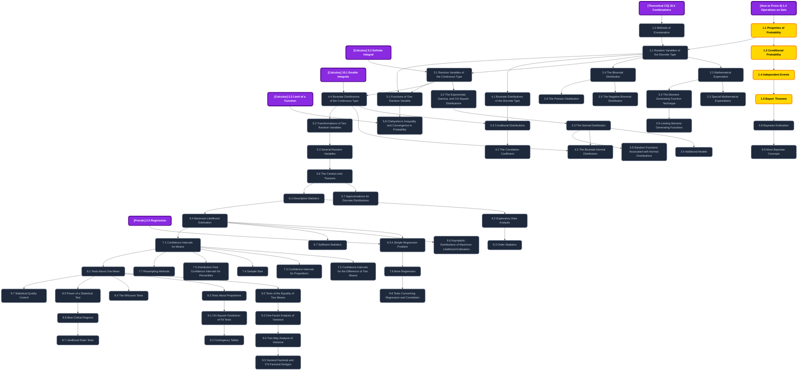

```mermaid
flowchart TD
    classDef completed fill:#FFD700,stroke:#FF8C00,stroke-width:4px,rx:10px,ry:10px,color:#000000,font-weight:bold;
    classDef incomplete fill:#1E293B,stroke:#64748B,stroke-width:3px,stroke-dasharray: 5 5,rx:10px,ry:10px,color:#CBD5E1;
    classDef prereq fill:#8A2BE2,stroke:#4B0082,stroke-width:4px,rx:10px,ry:10px,color:#FFFFFF,font-weight:bold;

    %% PREREQUISITES
    PRE_HTPI1_4["[How to Prove It] 1.4 Operations on Sets"]:::prereq
    PRE_TCS18_2["[Theoretical CS] 18.4 Combinations"]:::prereq
    PRE_CALC5_2["[Calculus] 5.2 Definite Integral"]:::prereq
    PRE_CALC15_1["[Calculus] 15.1 Double Integrals"]:::prereq
    PRE_CALC2_2["[Calculus] 2.2 Limit of a Function"]:::prereq
    PRE_C2_5["[Precalc] 2.5 Regression"]:::prereq

    %% PROB CHAPTER 1
    PROB1_1[1.1 Properties of Probability]:::completed
    PROB1_2[1.2 Methods of Enumeration]:::incomplete
    PROB1_3[1.3 Conditional Probability]:::completed
    PROB1_4[1.4 Independent Events]:::completed
    PROB1_5[1.5 Bayes' Theorem]:::completed
    PRE_HTPI1_4 --> PROB1_1
    PRE_TCS18_2 --> PROB1_2
    PROB1_1 --> PROB1_3 & PROB2_1
    PROB1_2 --> PROB2_1
    PROB1_3 --> PROB1_4
    PROB1_4 --> PROB1_5
    PROB1_5 --> PROB6_8

    %% PROB CHAPTER 2
    PROB2_1[2.1 Random Variables of the Discrete Type]:::incomplete
    PROB2_2[2.2 Mathematical Expectation]:::incomplete
    PROB2_3[2.3 Special Mathematical Expectations]:::incomplete
    PROB2_4[2.4 The Binomial Distribution]:::incomplete
    PROB2_5[2.5 The Negative Binomial Distribution]:::incomplete
    PROB2_6[2.6 The Poisson Distribution]:::incomplete
    PROB2_1 --> PROB2_2 & PROB2_4 & PROB3_1 & PROB4_1 & PROB5_1
    PROB2_2 --> PROB2_3 & PROB5_4
    PROB2_4 --> PROB2_5 & PROB2_6

    %% PROB CHAPTER 3
    PROB3_1[3.1 Random Variables of the Continuous Type]:::incomplete
    PROB3_2[3.2 The Exponential, Gamma, and Chi-Square Distributions]:::incomplete
    PROB3_3[3.3 The Normal Distribution]:::incomplete
    PROB3_4[3.4 Additional Models]:::incomplete
    PRE_CALC5_2 --> PROB3_1
    PROB3_1 --> PROB3_2 & PROB4_4 & PROB5_1
    PROB3_2 --> PROB3_3
    PROB3_3 --> PROB3_4 & PROB4_5 & PROB5_5

    %% PROB CHAPTER 4
    PROB4_1[4.1 Bivariate Distributions of the Discrete Type]:::incomplete
    PROB4_2[4.2 The Correlation Coefficient]:::incomplete
    PROB4_3[4.3 Conditional Distributions]:::incomplete
    PROB4_4[4.4 Bivariate Distributions of the Continuous Type]:::incomplete
    PROB4_5[4.5 The Bivariate Normal Distribution]:::incomplete
    PROB4_1 --> PROB4_3
    PROB4_3 --> PROB4_2
    PRE_CALC15_1 --> PROB4_4
    PROB4_4 --> PROB4_3 & PROB4_5 & PROB5_2

    %% PROB CHAPTER 5
    PROB5_1[5.1 Functions of One Random Variable]:::incomplete
    PROB5_2[5.2 Transformations of Two Random Variables]:::incomplete
    PROB5_3[5.3 Several Random Variables]:::incomplete
    PROB5_4[5.4 The Moment-Generating Function Technique]:::incomplete
    PROB5_5[5.5 Random Functions Associated with Normal Distributions]:::incomplete
    PROB5_6[5.6 The Central Limit Theorem]:::incomplete
    PROB5_7[5.7 Approximations for Discrete Distributions]:::incomplete
    PROB5_8[5.8 Chebyshev's Inequality and Convergence in Probability]:::incomplete
    PROB5_9[5.9 Limiting Moment-Generating Functions]:::incomplete
    PROB5_1 --> PROB5_8
    PROB5_2 --> PROB5_3
    PROB5_3 --> PROB5_6
    PROB5_6 --> PROB5_7 & PROB6_1
    PRE_CALC2_2 --> PROB5_8
    PROB5_4 --> PROB5_9

    %% PROB CHAPTER 6
    PROB6_1[6.1 Descriptive Statistics]:::incomplete
    PROB6_2[6.2 Exploratory Data Analysis]:::incomplete
    PROB6_3[6.3 Order Statistics]:::incomplete
    PROB6_4[6.4 Maximum Likelihood Estimation]:::incomplete
    PROB6_5[6.5 A Simple Regression Problem]:::incomplete
    PROB6_6[6.6 Asymptotic Distributions of Maximum Likelihood Estimators]:::incomplete
    PROB6_7[6.7 Sufficient Statistics]:::incomplete
    PROB6_8[6.8 Bayesian Estimation]:::incomplete
    PROB6_9[6.9 More Bayesian Concepts]:::incomplete
    PROB6_1 --> PROB6_2 & PROB6_4
    PROB6_2 --> PROB6_3
    PRE_C2_5 --> PROB6_5
    PROB6_4 --> PROB6_5 & PROB6_6 & PROB6_7 & PROB7_1
    PROB6_8 --> PROB6_9

    %% PROB CHAPTER 7
    PROB7_1[7.1 Confidence Intervals for Means]:::incomplete
    PROB7_2[7.2 Confidence Intervals for the Difference of Two Means]:::incomplete
    PROB7_3[7.3 Confidence Intervals for Proportions]:::incomplete
    PROB7_4[7.4 Sample Size]:::incomplete
    PROB7_5[7.5 Distribution-Free Confidence Intervals for Percentiles]:::incomplete
    PROB7_6[7.6 More Regression]:::incomplete
    PROB7_7[7.7 Resampling Methods]:::incomplete
    PROB7_1 --> PROB7_2 & PROB7_3 & PROB7_4 & PROB7_5 & PROB7_7 & PROB8_1
    PROB6_5 --> PROB7_6
    PROB7_6 --> PROB9_6

    %% PROB CHAPTER 8
    PROB8_1[8.1 Tests About One Mean]:::incomplete
    PROB8_2[8.2 Tests of the Equality of Two Means]:::incomplete
    PROB8_3[8.3 Tests About Proportions]:::incomplete
    PROB8_4[8.4 The Wilcoxon Tests]:::incomplete
    PROB8_5[8.5 Power of a Statistical Test]:::incomplete
    PROB8_6[8.6 Best Critical Regions]:::incomplete
    PROB8_7[8.7 Likelihood Ratio Tests]:::incomplete
    PROB8_1 --> PROB8_2 & PROB8_3 & PROB8_4 & PROB8_5 & PROB9_7
    PROB8_5 --> PROB8_6
    PROB8_6 --> PROB8_7

    %% PROB CHAPTER 9
    PROB9_1[9.1 Chi-Square Goodness-of-Fit Tests]:::incomplete
    PROB9_2[9.2 Contingency Tables]:::incomplete
    PROB9_3[9.3 One-Factor Analysis of Variance]:::incomplete
    PROB9_4[9.4 Two-Way Analysis of Variance]:::incomplete
    PROB9_5[9.5 General Factorial and 2^k Factorial Designs]:::incomplete
    PROB9_6[9.6 Tests Concerning Regression and Correlation]:::incomplete
    PROB9_7[9.7 Statistical Quality Control]:::incomplete
    PROB8_3 --> PROB9_1
    PROB9_1 --> PROB9_2
    PROB8_2 --> PROB9_3
    PROB9_3 --> PROB9_4
    PROB9_4 --> PROB9_5
```