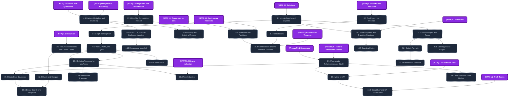

```mermaid
flowchart TD
    classDef completed fill:#FFD700,stroke:#FF8C00,stroke-width:4px,rx:10px,ry:10px,color:#000000,font-weight:bold;
    classDef incomplete fill:#1E293B,stroke:#64748B,stroke-width:3px,stroke-dasharray: 5 5,rx:10px,ry:10px,color:#CBD5E1;
    classDef prereq fill:#8A2BE2,stroke:#4B0082,stroke-width:4px,rx:10px,ry:10px,color:#FFFFFF,font-weight:bold;

    %% PREREQUISITES
    PRE_PA_FACT["[Pre-Algebra] Intro to Factoring"]:::prereq
    PRE_HTPI3_3["[HTPI] 3.3 Proofs with Quantifiers"]:::prereq
    PRE_HTPI5_2["[HTPI] 5.2 One-to-one and Onto"]:::prereq
    PRE_HTPI1_4["[HTPI] 1.4 Operations on Sets"]:::prereq
    PRE_HTPI4_6["[HTPI] 4.6 Equivalence Relations"]:::prereq
    PRE_C9_4["[Precalc] 9.4 Binomial Theorem"]:::prereq
    PRE_HTPI4_2["[HTPI] 4.2 Relations"]:::prereq
    PRE_HTPI6_3["[HTPI] 6.3 Recursion"]:::prereq
    PRE_HTPI6_4["[HTPI] 6.4 Strong Induction"]:::prereq
    PRE_C9_1["[Precalc] 9.1 Sequences"]:::prereq
    PRE_C4_1["[Precalc] 4.1 Intro to Rational Functions"]:::prereq
    PRE_HTPI7_2["[HTPI] 7.2 Countable Sets"]:::prereq
    PRE_HTPI1_2["[HTPI] 1.2 Truth Tables"]:::prereq
    PRE_HTPI3_2["[HTPI] 3.2 Negations and Conditionals"]:::prereq
    PRE_HTPI5_1["[HTPI] 5.1 Functions"]:::prereq

    %% TCS CHAPTER 4
    TCS4_1[4.1 Factors, Multiples, and Divisibility]:::incomplete
    TCS4_2[4.5 GCD, LCM, and the Euclidean Algorithm]:::incomplete
    TCS4_3[4.10 Congruence Modulo k]:::incomplete
    PRE_HTPI3_3 --> TCS4_1
    PRE_PA_FACT --> TCS4_1
    TCS4_1 --> TCS4_2 & TCS17_2
    TCS4_2 --> TCS4_3

    %% TCS CHAPTER 8 & 18
    TCS8_1[8.3 The Pigeonhole Principle]:::incomplete
    TCS8_2[8.4 Permutations]:::incomplete
    TCS18_1[18.2 Powersets and Partitions]:::incomplete
    TCS18_2[18.4 Combinations and the Binomial Theorem]:::incomplete
    PRE_HTPI5_2 --> TCS8_1
    TCS8_1 --> TCS8_2
    PRE_HTPI1_4 --> TCS18_1
    PRE_HTPI4_6 --> TCS18_1
    TCS18_1 --> TCS18_2
    TCS8_2 --> TCS18_2
    PRE_C9_4 --> TCS18_2

    %% TCS CHAPTER 9
    TCS9_1[9.1 Intro to Graphs and Degrees]:::incomplete
    TCS9_2[9.5 Graph Isomorphism]:::incomplete
    TCS9_3[9.7 Walks, Paths, and Cycles]:::incomplete
    TCS9_4[9.10 Euler Circuits]:::incomplete
    PRE_HTPI4_2 --> TCS9_1
    TCS9_1 --> TCS9_2 & TCS19_1 & TCS21_1
    TCS9_2 --> TCS9_3
    TCS9_3 --> TCS9_4 & TCS13_1

    %% TCS CHAPTER 12
    TCS12_1[12.1 Recursive Definitions and Closed Forms]:::incomplete
    TCS12_2[12.3 Divide and Conquer]:::incomplete
    PRE_HTPI6_3 --> TCS12_1
    TCS12_1 --> TCS12_2 & TCS13_1

    %% TCS CHAPTER 13
    TCS13_1[13.2 Defining Trees and m-ary Trees]:::incomplete
    TCS13_2[13.5 Context-Free Grammars]:::incomplete
    TCS13_3[13.8 Tree Induction]:::incomplete
    TCS13_1 --> TCS13_2 & TCS13_3 & TCS15_1
    PRE_HTPI6_4 --> TCS13_3

    %% TCS CHAPTER 14
    TCS14_1[14.2 Asymptotic Relationships and Big-O]:::incomplete
    TCS14_2[14.4 The Dominant Term Method]:::incomplete
    PRE_C9_1 --> TCS14_1
    PRE_C4_1 --> TCS14_1
    TCS14_1 --> TCS14_2 & TCS15_1 & TCS16_1

    %% TCS CHAPTER 15
    TCS15_1[15.2 Basic Data Structures]:::incomplete
    TCS15_2[15.6 Binary Search and Mergesort]:::incomplete
    TCS15_1 --> TCS15_2
    TCS12_2 --> TCS15_2

    %% TCS CHAPTER 16
    TCS16_1[16.2 What is NP?]:::incomplete
    TCS16_2[16.3 Circuit SAT and NP Completeness]:::incomplete
    PRE_HTPI7_2 --> TCS16_1
    TCS16_1 --> TCS16_2
    PRE_HTPI1_2 --> TCS16_2

    %% TCS CHAPTER 17
    TCS17_1[17.1 Proof by Contradiction Method]:::incomplete
    TCS17_2[17.2 Irrationality and Infinity of Primes]:::incomplete
    PRE_HTPI3_2 --> TCS17_1
    TCS17_1 --> TCS17_2

    %% TCS CHAPTER 19
    TCS19_1[19.1 State Diagrams and Transition Functions]:::incomplete
    TCS19_2[19.7 Counting States]:::incomplete
    PRE_HTPI5_1 --> TCS19_1
    TCS19_1 --> TCS19_2

    %% TCS CHAPTER 21
    TCS21_1[21.1 Planar Graphs and Faces]:::incomplete
    TCS21_2[21.4 Euler's Formula]:::incomplete
    TCS21_3[21.7 Kuratowski's Theorem]:::incomplete
    TCS21_4[21.8 Coloring Planar Graphs]:::incomplete
    TCS21_1 --> TCS21_2 & TCS21_4
    TCS21_2 --> TCS21_3
```