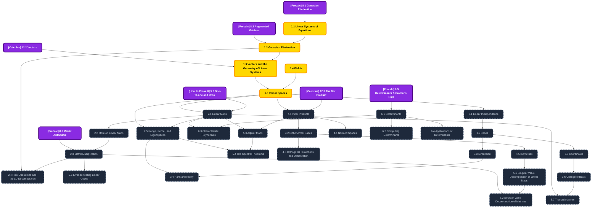

```mermaid
flowchart TD
    classDef completed fill:#FFD700,stroke:#FF8C00,stroke-width:4px,rx:10px,ry:10px,color:#000000,font-weight:bold;
    classDef incomplete fill:#1E293B,stroke:#64748B,stroke-width:3px,stroke-dasharray: 5 5,rx:10px,ry:10px,color:#CBD5E1;
    classDef prereq fill:#8A2BE2,stroke:#4B0082,stroke-width:4px,rx:10px,ry:10px,color:#FFFFFF,font-weight:bold;

    %% PREREQUISITES
    PRE_C8_1["[Precalc] 8.1 Gaussian Elimination"]:::prereq
    PRE_C8_2["[Precalc] 8.2 Augmented Matrices"]:::prereq
    PRE_C8_3["[Precalc] 8.3 Matrix Arithmetic"]:::prereq
    PRE_C8_5["[Precalc] 8.5 Determinants & Cramer's Rule"]:::prereq
    PRE_CALC12_2["[Calculus] 12.2 Vectors"]:::prereq
    PRE_CALC12_3["[Calculus] 12.3 The Dot Product"]:::prereq
    PRE_HTPI5_2["[How to Prove It] 5.2 One-to-one and Onto"]:::prereq

    %% LA CHAPTER 1
    LA1_1[1.1 Linear Systems of Equations]:::completed
    LA1_2[1.2 Gaussian Elimination]:::completed
    LA1_3[1.3 Vectors and the Geometry of Linear Systems]:::completed
    LA1_4[1.4 Fields]:::completed
    LA1_5[1.5 Vector Spaces]:::completed
    PRE_C8_1 --> LA1_1
    PRE_C8_2 --> LA1_2
    LA1_1 --> LA1_2
    PRE_CALC12_2 --> LA1_3
    LA1_2 --> LA1_3 & LA2_4
    LA1_3 --> LA1_5
    LA1_4 --> LA1_5

    %% LA CHAPTER 2
    LA2_1[2.1 Linear Maps]:::incomplete
    LA2_2[2.2 More on Linear Maps]:::incomplete
    LA2_3[2.3 Matrix Multiplication]:::incomplete
    LA2_4[2.4 Row Operations and the LU Decomposition]:::incomplete
    LA2_5[2.5 Range, Kernel, and Eigenspaces]:::incomplete
    LA2_6[2.6 Error-correcting Linear Codes]:::incomplete
    LA1_5 --> LA2_1 & LA2_5 & LA3_1 & LA4_1
    PRE_HTPI5_2 --> LA2_1
    LA2_1 --> LA2_2 & LA2_5 & LA3_7 & LA5_3 & LA6_3
    PRE_C8_3 --> LA2_3
    LA2_2 --> LA2_3
    LA2_3 --> LA2_4 & LA2_6 & LA5_2

    %% LA CHAPTER 3
    LA3_1[3.1 Linear In/dependence]:::incomplete
    LA3_2[3.2 Bases]:::incomplete
    LA3_3[3.3 Dimension]:::incomplete
    LA3_4[3.4 Rank and Nullity]:::incomplete
    LA3_5[3.5 Coordinates]:::incomplete
    LA3_6[3.6 Change of Basis]:::incomplete
    LA3_7[3.7 Triangularization]:::incomplete
    LA3_1 --> LA3_2
    LA3_2 --> LA3_3 & LA3_5
    LA2_5 --> LA3_4 & LA5_4
    LA3_3 --> LA3_4
    LA3_5 --> LA3_6
    LA3_6 --> LA3_7

    %% LA CHAPTER 4
    LA4_1[4.1 Inner Products]:::incomplete
    LA4_2[4.2 Orthonormal Bases]:::incomplete
    LA4_3[4.3 Orthogonal Projections and Optimization]:::incomplete
    LA4_4[4.4 Normed Spaces]:::incomplete
    LA4_5[4.5 Isometries]:::incomplete
    PRE_CALC12_3 --> LA4_1
    LA4_1 --> LA4_2 & LA4_4 & LA5_3
    LA4_2 --> LA4_3 & LA4_5

    %% LA CHAPTER 5
    LA5_1[5.1 Singular Value Decomposition of Linear Maps]:::incomplete
    LA5_2[5.2 Singular Value Decomposition of Matrices]:::incomplete
    LA5_3[5.3 Adjoint Maps]:::incomplete
    LA5_4[5.4 The Spectral Theorems]:::incomplete
    LA4_5 --> LA5_1
    LA5_1 --> LA5_2
    LA5_3 --> LA5_4

    %% LA CHAPTER 6
    LA6_1[6.1 Determinants]:::incomplete
    LA6_2[6.2 Computing Determinants]:::incomplete
    LA6_3[6.3 Characteristic Polynomials]:::incomplete
    LA6_4[6.4 Applications of Determinants]:::incomplete
    PRE_C8_5 --> LA6_1
    LA6_1 --> LA6_2 & LA6_3 & LA6_4
```