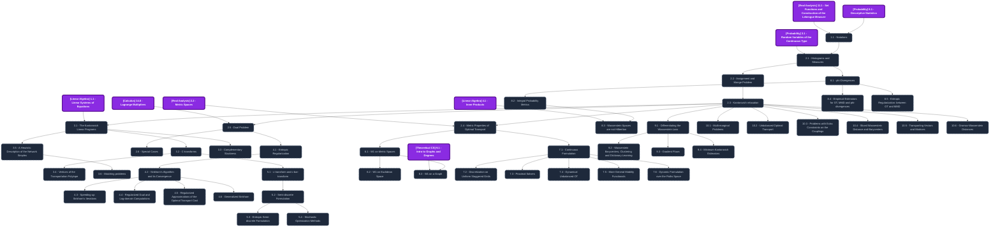

```mermaid
flowchart TD
    classDef completed fill:#FFD700,stroke:#FF8C00,stroke-width:4px,rx:10px,ry:10px,color:#000000,font-weight:bold;
    classDef incomplete fill:#1E293B,stroke:#64748B,stroke-width:3px,stroke-dasharray: 5 5,rx:10px,ry:10px,color:#CBD5E1;
    classDef prereq fill:#8A2BE2,stroke:#4B0082,stroke-width:4px,rx:10px,ry:10px,color:#FFFFFF,font-weight:bold;

    %% PREREQUISITES
    PRE_LA1_1["[Linear Algebra] 1.1 - Linear Systems of Equations"]:::prereq
    PRE_LA4_1["[Linear Algebra] 4.1 - Inner Products"]:::prereq
    PRE_CALC14_8["[Calculus] 14.8 - Lagrange Multipliers"]:::prereq
    PRE_RA2_2["[Real Analysis] 2.2 - Metric Spaces"]:::prereq
    PRE_RA11_1["[Real Analysis] 11.1 - Set Functions and Construction of the Lebesgue Measure"]:::prereq
    PRE_PROB3_1["[Probability] 3.1 - Random Variables of the Continuous Type"]:::prereq
    PRE_PROB6_1["[Probability] 6.1 - Descriptive Statistics"]:::prereq
    PRE_TCS9_1["[Theoretical CS] 9.1 - Intro to Graphs and Degrees"]:::prereq

    %% ==========================================
    %% COMPUTATIONAL OPTIMAL TRANSPORT (PEYRE & CUTURI)
    %% ==========================================

    %% CHAPTER 1: INTRODUCTION
    COT1_1["1.1 - Notations"]:::incomplete

    PRE_PROB6_1 --> COT1_1
    PRE_RA11_1 --> COT1_1

    %% CHAPTER 2: THEORETICAL FOUNDATIONS
    COT2_1["2.1 - Histograms and Measures"]:::incomplete
    COT2_2["2.2 - Assignment and Monge Problem"]:::incomplete
    COT2_3["2.3 - Kantorovich relaxation"]:::incomplete
    COT2_4["2.4 - Metric Properties of Optimal Transport"]:::incomplete
    COT2_5["2.5 - Dual Problem"]:::incomplete
    COT2_6["2.6 - Special Cases"]:::incomplete

    COT1_1 --> COT2_1
    PRE_PROB3_1 --> COT2_1
    COT2_1 --> COT2_2
    COT2_2 --> COT2_3
    COT2_3 --> COT2_4
    PRE_RA2_2 --> COT2_4
    COT2_3 --> COT2_5
    PRE_CALC14_8 --> COT2_5
    COT2_5 --> COT2_6

    %% CHAPTER 3: ALGORITHMIC FOUNDATIONS
    COT3_1["3.1 - The Kantorovich Linear Programs"]:::incomplete
    COT3_2["3.2 - C-transforms"]:::incomplete
    COT3_3["3.3 - Complementary Slackness"]:::incomplete
    COT3_4["3.4 - Vertices of the Transportation Polytope"]:::incomplete
    COT3_5["3.5 - A Heuristic Description of the Network Simplex"]:::incomplete
    COT3_6["3.6 - Matching problems"]:::incomplete

    COT2_3 --> COT3_1
    PRE_LA1_1 --> COT3_1
    COT3_1 --> COT3_2
    COT3_1 --> COT3_3
    COT3_2 --> COT3_4
    COT3_1 --> COT3_5
    COT3_5 --> COT3_6

    %% CHAPTER 4: ENTROPIC REGULARIZATION OF OPTIMAL TRANSPORT
    COT4_1["4.1 - Entropic Regularization"]:::incomplete
    COT4_2["4.2 - Sinkhorn's Algorithm and its Convergence"]:::incomplete
    COT4_3["4.3 - Speeding-up Sinkhorn's Iterations"]:::incomplete
    COT4_4["4.4 - Regularized Dual and Log-domain Computations"]:::incomplete
    COT4_5["4.5 - Regularized Approximations of the Optimal Transport Cost"]:::incomplete
    COT4_6["4.6 - Generalized Sinkhorn"]:::incomplete

    COT2_5 --> COT4_1
    COT4_1 --> COT4_2
    COT4_2 --> COT4_3
    COT4_2 --> COT4_4
    COT4_2 --> COT4_5
    COT4_2 --> COT4_6

    %% CHAPTER 5: SEMI-DISCRETE OPTIMAL TRANSPORT
    COT5_1["5.1 - c-transform and c-bar-transform"]:::incomplete
    COT5_2["5.2 - Semi-discrete Formulation"]:::incomplete
    COT5_3["5.3 - Entropic Semi-discrete Formulation"]:::incomplete
    COT5_4["5.4 - Stochastic Optimization Methods"]:::incomplete

    COT3_2 --> COT5_1
    COT5_1 --> COT5_2
    COT5_2 --> COT5_3
    COT5_2 --> COT5_4

    %% CHAPTER 6: W1 OPTIMAL TRANSPORT
    COT6_1["6.1 - W1 on Metric Spaces"]:::incomplete
    COT6_2["6.2 - W1 on Euclidean Space"]:::incomplete
    COT6_3["6.3 - W1 on a Graph"]:::incomplete

    COT2_4 --> COT6_1
    COT6_1 --> COT6_2
    COT6_1 --> COT6_3
    PRE_TCS9_1 --> COT6_3

    %% CHAPTER 7: DYNAMIC FORMULATIONS
    COT7_1["7.1 - Continuous Formulation"]:::incomplete
    COT7_2["7.2 - Discretization on Uniform Staggered Grids"]:::incomplete
    COT7_3["7.3 - Proximal Solvers"]:::incomplete
    COT7_4["7.4 - Dynamical Unbalanced OT"]:::incomplete
    COT7_5["7.5 - More General Mobility Functionals"]:::incomplete
    COT7_6["7.6 - Dynamic Formulation over the Paths Space"]:::incomplete

    COT2_4 --> COT7_1
    COT7_1 --> COT7_2
    COT7_1 --> COT7_3
    COT7_1 --> COT7_4
    COT7_1 --> COT7_5
    COT7_1 --> COT7_6

    %% CHAPTER 8: STATISTICAL DIVERGENCES
    COT8_1["8.1 - phi-Divergences"]:::incomplete
    COT8_2["8.2 - Integral Probability Metrics"]:::incomplete
    COT8_3["8.3 - Wasserstein Spaces are not Hilbertian"]:::incomplete
    COT8_4["8.4 - Empirical Estimators for OT, MMD and phi-divergences"]:::incomplete
    COT8_5["8.5 - Entropic Regularization: between OT and MMD"]:::incomplete

    COT2_1 --> COT8_1
    COT8_1 --> COT8_2
    COT8_2 --> COT8_3
    PRE_LA4_1 --> COT8_3
    COT8_1 --> COT8_4
    COT8_1 --> COT8_5

    %% CHAPTER 9: VARIATIONAL WASSERSTEIN PROBLEMS
    COT9_1["9.1 - Differentiating the Wasserstein Loss"]:::incomplete
    COT9_2["9.2 - Wasserstein Barycenters, Clustering and Dictionary Learning"]:::incomplete
    COT9_3["9.3 - Gradient Flows"]:::incomplete
    COT9_4["9.4 - Minimum Kantorovich Estimators"]:::incomplete

    COT2_3 --> COT9_1
    COT9_1 --> COT9_2
    COT9_1 --> COT9_3
    COT9_1 --> COT9_4

    %% CHAPTER 10: EXTENSIONS OF OPTIMAL TRANSPORT
    COT10_1["10.1 - Multi-marginal Problems"]:::incomplete
    COT10_2["10.2 - Unbalanced Optimal Transport"]:::incomplete
    COT10_3["10.3 - Problems with Extra Constraints on the Couplings"]:::incomplete
    COT10_4["10.4 - Sliced Wasserstein Distance and Barycenters"]:::incomplete
    COT10_5["10.5 - Transporting Vectors and Matrices"]:::incomplete
    COT10_6["10.6 - Gromov-Wasserstein Distances"]:::incomplete

    COT2_3 --> COT10_1
    COT2_3 --> COT10_2
    COT2_3 --> COT10_3
    COT2_3 --> COT10_4
    COT2_3 --> COT10_5
    COT2_3 --> COT10_6

    %% ==========================================
    %% CLASS ASSIGNMENTS
    %% ==========================================
    class COT1_1,COT2_1,COT2_2,COT2_3,COT2_4,COT2_5,COT2_6,COT3_1,COT3_2,COT3_3,COT3_4,COT3_5,COT3_6,COT4_1,COT4_2,COT4_3,COT4_4,COT4_5,COT4_6,COT5_1,COT5_2,COT5_3,COT5_4,COT6_1,COT6_2,COT6_3,COT7_1,COT7_2,COT7_3,COT7_4,COT7_5,COT7_6,COT8_1,COT8_2,COT8_3,COT8_4,COT8_5,COT9_1,COT9_2,COT9_3,COT9_4,COT10_1,COT10_2,COT10_3,COT10_4,COT10_5,COT10_6 incomplete;
```