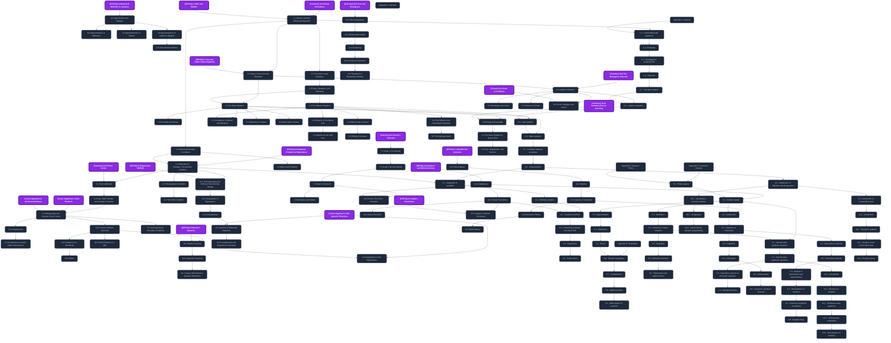

```mermaid
flowchart TD
    classDef completed fill:#FFD700,stroke:#FF8C00,stroke-width:4px,rx:10px,ry:10px,color:#000000,font-weight:bold;
    classDef incomplete fill:#1E293B,stroke:#64748B,stroke-width:3px,stroke-dasharray: 5 5,rx:10px,ry:10px,color:#CBD5E1;
    classDef prereq fill:#8A2BE2,stroke:#4B0082,stroke-width:4px,rx:10px,ry:10px,color:#FFFFFF,font-weight:bold;

    %% PREREQUISITES
    PRE_CALC14_3["[Calculus] 14.3 Partial Derivatives"]:::prereq
    PRE_CALC11_8["[Calculus] 11.8 Power Series"]:::prereq
    PRE_CALC16_9["[Calculus] 16.9 The Divergence Theorem"]:::prereq
    PRE_CALC16_4["[Calculus] 16.4 Green's Theorem"]:::prereq
    PRE_CALC16_10["[Calculus] 16.10 Summary (Vector Calculus)"]:::prereq
    PRE_CALC16_5["[Calculus] 16.5 Curl and Divergence"]:::prereq
    PRE_C11_4["[Precalc] 11.4 Polar Coordinates"]:::prereq
    PRE_DE1_1["[Diff Eq] 1.1 DEs and Models"]:::prereq
    PRE_DE2_1["[Diff Eq] 2.1 Second-Order Linear Equations"]:::prereq
    PRE_DE2_8["[Diff Eq] 2.8 Endpoint Problems & Eigenvalues"]:::prereq
    PRE_DE6_4["[Diff Eq] 6.4 Numerical Methods for Systems"]:::prereq
    PRE_DE3_5["[Diff Eq] 3.5 Bessel's Equation"]:::prereq
    PRE_DE5_4["[Diff Eq] 5.4 Eigenvalue Method"]:::prereq
    PRE_DE4_6["[Diff Eq] 4.6 Impulses and Delta Functions"]:::prereq
    PRE_DE4_1["[Diff Eq] 4.1 Laplace Transforms"]:::prereq
    PRE_DE7_1["[Diff Eq] 7.1 Equilibrium Solutions"]:::prereq
    PRE_LA4_1["[Linear Algebra] 4.1 Inner Products"]:::prereq
    PRE_LA4_2["[Linear Algebra] 4.2 Orthonormal Bases"]:::prereq
    PRE_LA5_4["[Linear Algebra] 5.4 The Spectral Theorems"]:::prereq

    %% ==========================================
    %% PARTIAL DIFFERENTIAL EQUATIONS (STRAUSS)
    %% ==========================================

    %% PDE CHAPTER 1
    PDE1_1["1.1 What is a Partial Differential Equation?"]:::incomplete
    PDE1_2["1.2 First-Order Linear Equations"]:::incomplete
    PDE1_3["1.3 Flows, Vibrations, and Diffusions"]:::incomplete
    PDE1_4["1.4 Initial and Boundary Conditions"]:::incomplete
    PDE1_5["1.5 Well-Posed Problems"]:::incomplete
    PDE1_6["1.6 Types of Second-Order Equations"]:::incomplete
    PRE_CALC14_3 --> PDE1_1
    PRE_DE1_1 --> PDE1_1
    PDE1_1 --> PDE1_2 & PDE1_4 & PDE1_6
    PDE1_2 --> PDE1_3
    PDE1_4 --> PDE1_5
    PRE_DE2_1 --> PDE1_6

    %% PDE CHAPTER 2
    PDE2_1["2.1 The Wave Equation"]:::incomplete
    PDE2_2["2.2 Causality and Energy"]:::incomplete
    PDE2_3["2.3 The Diffusion Equation"]:::incomplete
    PDE2_4["2.4 Diffusion on the Whole Line"]:::incomplete
    PDE2_5["2.5 Comparison of Waves and Diffusions"]:::incomplete
    PDE1_6 --> PDE2_1
    PDE1_3 --> PDE2_1 & PDE2_3
    PDE2_1 --> PDE2_2 & PDE2_5 & PDE3_2 & PDE3_4 & PDE9_1
    PDE2_3 --> PDE2_4 & PDE2_5 & PDE3_3 & PDE9_4
    
    %% PDE CHAPTER 3
    PDE3_1["3.1 Diffusion on the Half-Line"]:::incomplete
    PDE3_2["3.2 Reflections of Waves"]:::incomplete
    PDE3_3["3.3 Diffusion with a Source"]:::incomplete
    PDE3_4["3.4 Waves with a Source"]:::incomplete
    PDE3_5["3.5 Diffusion Revisited"]:::incomplete
    PDE2_4 --> PDE3_1
    PDE3_3 --> PDE3_5

    %% PDE CHAPTER 4
    PDE4_1["4.1 Separation of Variables, The Dirichlet Condition"]:::incomplete
    PDE4_2["4.2 The Neumann Condition"]:::incomplete
    PDE4_3["4.3 The Robin Condition"]:::incomplete
    PRE_DE2_8 --> PDE4_1
    PDE1_4 --> PDE4_1
    PDE4_1 --> PDE4_2 & PDE5_1 & PDE11_1
    PDE4_2 --> PDE4_3

    %% PDE CHAPTER 5
    PDE5_1["5.1 The Coefficients"]:::incomplete
    PDE5_2["5.2 Even, Odd, Periodic, and Complex Functions"]:::incomplete
    PDE5_3["5.3 Orthogonality and General Fourier Series"]:::incomplete
    PDE5_4["5.4 Completeness"]:::incomplete
    PDE5_5["5.5 Completeness and the Gibbs Phenomenon"]:::incomplete
    PDE5_6["5.6 Inhomogeneous Boundary Conditions"]:::incomplete
    PRE_CALC11_8 --> PDE5_1
    PDE5_1 --> PDE5_2
    PDE5_2 --> PDE5_3
    PRE_LA4_1 --> PDE5_3
    PRE_LA4_2 --> PDE5_3
    PDE5_3 --> PDE5_4 & PDE5_6 & PDE10_1
    PDE5_4 --> PDE5_5

    %% PDE CHAPTER 6
    PDE6_1["6.1 Laplace's Equation"]:::incomplete
    PDE6_2["6.2 Rectangles and Cubes"]:::incomplete
    PDE6_3["6.3 Poisson's Formula"]:::incomplete
    PDE6_4["6.4 Circles, Wedges, and Annuli"]:::incomplete
    PRE_CALC16_9 --> PDE6_1
    PDE1_6 --> PDE6_1
    PDE6_1 --> PDE6_2 & PDE6_3 & PDE6_4
    PRE_C11_4 --> PDE6_4

    %% PDE CHAPTER 7
    PDE7_1["7.1 Green's First Identity"]:::incomplete
    PDE7_2["7.2 Green's Second Identity"]:::incomplete
    PDE7_3["7.3 Green's Functions"]:::incomplete
    PDE7_4["7.4 Half-Space and Sphere"]:::incomplete
    PRE_CALC16_4 --> PDE7_1
    PDE7_1 --> PDE7_2
    PDE7_2 --> PDE7_3
    PDE7_3 --> PDE7_4 & PDE12_2

    %% PDE CHAPTER 8
    PDE8_1["8.1 Opportunities and Dangers"]:::incomplete
    PDE8_2["8.2 Approximations of Diffusions"]:::incomplete
    PDE8_3["8.3 Approximations of Waves"]:::incomplete
    PDE8_4["8.4 Approximations of Laplace's Equation"]:::incomplete
    PDE8_5["8.5 Finite Element Method"]:::incomplete
    PRE_DE6_4 --> PDE8_1
    PDE8_1 --> PDE8_2 & PDE8_3 & PDE8_4
    PDE8_4 --> PDE8_5

    %% PDE CHAPTER 9
    PDE9_1["9.1 Energy and Causality"]:::incomplete
    PDE9_2["9.2 The Wave Equation in Space-Time"]:::incomplete
    PDE9_3["9.3 Rays, Singularities, and Sources"]:::incomplete
    PDE9_4["9.4 The Diffusion and Schrodinger Equations"]:::incomplete
    PDE9_5["9.5 The Hydrogen Atom"]:::incomplete
    PRE_CALC16_10 --> PDE9_1
    PDE9_1 --> PDE9_2
    PDE9_2 --> PDE9_3
    PDE9_4 --> PDE9_5

    %% PDE CHAPTER 10
    PDE10_1["10.1 Fourier's Method, Revisited"]:::incomplete
    PDE10_2["10.2 Vibrations of a Drumhead"]:::incomplete
    PDE10_3["10.3 Solid Vibrations in a Ball"]:::incomplete
    PDE10_4["10.4 Nodes"]:::incomplete
    PDE10_5["10.5 Bessel Functions"]:::incomplete
    PDE10_6["10.6 Legendre Functions"]:::incomplete
    PDE10_7["10.7 Angular Momentum in Quantum Mechanics"]:::incomplete
    PDE10_1 --> PDE10_2 & PDE10_3 & PDE10_5
    PDE10_2 --> PDE10_4
    PRE_DE3_5 --> PDE10_5
    PDE10_5 --> PDE10_6
    PDE10_6 --> PDE10_7

    %% PDE CHAPTER 11
    PDE11_1["11.1 The Eigenvalues Are Minima of the Potential Energy"]:::incomplete
    PDE11_2["11.2 Computation of Eigenvalues"]:::incomplete
    PDE11_3["11.3 Completeness"]:::incomplete
    PDE11_4["11.4 Symmetric Differential Operators"]:::incomplete
    PDE11_5["11.5 Completeness and Separation of Variables"]:::incomplete
    PDE11_6["11.6 Asymptotics of the Eigenvalues"]:::incomplete
    PRE_DE5_4 --> PDE11_1
    PDE11_1 --> PDE11_2
    PDE11_2 --> PDE11_3
    PDE11_3 --> PDE11_4
    PRE_LA5_4 --> PDE11_4 & PDE11_6
    PDE11_4 --> PDE11_5
    PDE11_5 --> PDE11_6

    %% PDE CHAPTER 12
    PDE12_1["12.1 Distributions"]:::incomplete
    PDE12_2["12.2 Green's Functions, Revisited"]:::incomplete
    PDE12_3["12.3 Fourier Transforms"]:::incomplete
    PDE12_4["12.4 Source Functions"]:::incomplete
    PDE12_5["12.5 Laplace Transform Techniques"]:::incomplete
    PRE_DE4_6 --> PDE12_1
    PDE12_1 --> PDE12_2 & PDE12_3
    PDE12_3 --> PDE12_4 & PDE12_5
    PRE_DE4_1 --> PDE12_5

    %% PDE CHAPTER 13
    PDE13_1["13.1 Electromagnetism"]:::incomplete
    PDE13_2["13.2 Fluids and Acoustics"]:::incomplete
    PDE13_3["13.3 Scattering"]:::incomplete
    PDE13_4["13.4 Continuous Spectrum"]:::incomplete
    PDE13_5["13.5 Equations of Elementary Particles"]:::incomplete
    PRE_CALC16_5 --> PDE13_1
    PDE13_1 --> PDE13_2
    PDE13_2 --> PDE13_3
    PDE13_3 --> PDE13_4
    PDE13_4 --> PDE13_5

    %% PDE CHAPTER 14
    PDE14_1["14.1 Shock Waves"]:::incomplete
    PDE14_2["14.2 Solitons"]:::incomplete
    PDE14_3["14.3 Calculus of Variations"]:::incomplete
    PDE14_4["14.4 Bifurcation Theory"]:::incomplete
    PDE14_5["14.5 Water Waves"]:::incomplete
    PRE_DE7_1 --> PDE14_1
    PDE14_1 --> PDE14_2
    PDE14_2 --> PDE14_3
    PDE14_3 --> PDE14_4
    PDE14_4 --> PDE14_5

    %% ==========================================
    %% PARTIAL DIFFERENTIAL EQUATIONS (EVANS)
    %% ==========================================

    %% EVANS APPENDICES (Core prerequisites for Evans)
    EVANS_APP_A["Appendix A: Notation"]:::incomplete
    EVANS_APP_B["Appendix B: Inequalities"]:::incomplete
    EVANS_APP_C["Appendix C: Calculus"]:::incomplete
    EVANS_APP_D["Appendix D: Functional Analysis"]:::incomplete
    EVANS_APP_E["Appendix E: Measure Theory"]:::incomplete

    %% EVANS CHAPTER 1
    EVANS1_1["1.1 - Partial differential equations"]:::incomplete
    EVANS1_2["1.2 - Examples"]:::incomplete
    EVANS1_3["1.3 - Strategies for studying PDE"]:::incomplete
    EVANS1_4["1.4 - Overview"]:::incomplete

    PDE1_1 --> EVANS1_1
    EVANS_APP_A --> EVANS1_1
    EVANS1_1 --> EVANS1_2
    EVANS1_2 --> EVANS1_3
    EVANS1_3 --> EVANS1_4

    %% EVANS CHAPTER 2
    EVANS2_1["2.1 - Transport equation"]:::incomplete
    EVANS2_2["2.2 - Laplace's equation"]:::incomplete
    EVANS2_3["2.3 - Heat equation"]:::incomplete
    EVANS2_4["2.4 - Wave equation"]:::incomplete

    EVANS1_4 --> EVANS2_1
    PDE6_1 --> EVANS2_2
    EVANS2_1 --> EVANS2_2
    PDE2_3 --> EVANS2_3
    EVANS2_2 --> EVANS2_3
    PDE2_1 --> EVANS2_4
    EVANS2_3 --> EVANS2_4

    %% EVANS CHAPTER 3
    EVANS3_1["3.1 - Complete integrals, envelopes"]:::incomplete
    EVANS3_2["3.2 - Characteristics"]:::incomplete
    EVANS3_3["3.3 - Introduction to Hamilton-Jacobi equations"]:::incomplete
    EVANS3_4["3.4 - Introduction to conservation laws"]:::incomplete

    EVANS2_4 --> EVANS3_1
    EVANS3_1 --> EVANS3_2
    EVANS3_2 --> EVANS3_3
    EVANS3_3 --> EVANS3_4

    %% EVANS CHAPTER 4
    EVANS4_1["4.1 - Separation of variables"]:::incomplete
    EVANS4_2["4.2 - Similarity solutions"]:::incomplete
    EVANS4_3["4.3 - Transform methods"]:::incomplete
    EVANS4_4["4.4 - Converting nonlinear into linear PDE"]:::incomplete
    EVANS4_5["4.5 - Asymptotics"]:::incomplete
    EVANS4_6["4.6 - Power series"]:::incomplete

    EVANS3_2 --> EVANS4_1
    PDE4_1 --> EVANS4_1
    EVANS4_1 --> EVANS4_2
    EVANS4_2 --> EVANS4_3
    PDE12_3 --> EVANS4_3
    EVANS4_3 --> EVANS4_4
    EVANS4_4 --> EVANS4_5
    EVANS4_5 --> EVANS4_6

    %% EVANS CHAPTER 5
    EVANS5_1["5.1 - Hölder spaces"]:::incomplete
    EVANS5_2["5.2 - Sobolev spaces"]:::incomplete
    EVANS5_3["5.3 - Approximation"]:::incomplete
    EVANS5_4["5.4 - Extensions"]:::incomplete
    EVANS5_5["5.5 - Traces"]:::incomplete
    EVANS5_6["5.6 - Sobolev inequalities"]:::incomplete
    EVANS5_7["5.7 - Compactness"]:::incomplete
    EVANS5_8["5.8 - Additional topics"]:::incomplete
    EVANS5_9["5.9 - Other spaces of functions"]:::incomplete

    EVANS_APP_D --> EVANS5_1
    EVANS_APP_E --> EVANS5_1
    PDE12_1 --> EVANS5_2
    EVANS5_1 --> EVANS5_2
    EVANS5_2 --> EVANS5_3
    EVANS5_3 --> EVANS5_4
    EVANS5_4 --> EVANS5_5
    EVANS_APP_B --> EVANS5_6
    EVANS5_5 --> EVANS5_6
    EVANS5_6 --> EVANS5_7
    EVANS5_7 --> EVANS5_8
    EVANS5_8 --> EVANS5_9

    %% EVANS CHAPTER 6
    EVANS6_1["6.1 - Definitions"]:::incomplete
    EVANS6_2["6.2 - Existence of weak solutions"]:::incomplete
    EVANS6_3["6.3 - Regularity"]:::incomplete
    EVANS6_4["6.4 - Maximum principles"]:::incomplete
    EVANS6_5["6.5 - Eigenvalues and eigenfunctions"]:::incomplete

    EVANS5_2 --> EVANS6_1
    EVANS6_1 --> EVANS6_2
    EVANS6_2 --> EVANS6_3
    EVANS6_3 --> EVANS6_4
    EVANS6_4 --> EVANS6_5

    %% EVANS CHAPTER 7
    EVANS7_1["7.1 - Second-order parabolic equations"]:::incomplete
    EVANS7_2["7.2 - Second-order hyperbolic equations"]:::incomplete
    EVANS7_3["7.3 - Hyperbolic systems of first-order equations"]:::incomplete
    EVANS7_4["7.4 - Semigroup theory"]:::incomplete

    EVANS5_2 --> EVANS7_1
    EVANS6_2 --> EVANS7_1
    EVANS7_1 --> EVANS7_2
    EVANS7_2 --> EVANS7_3
    EVANS7_3 --> EVANS7_4

    %% EVANS CHAPTER 8
    EVANS8_1["8.1 - Introduction"]:::incomplete
    EVANS8_2["8.2 - Existence of minimizers"]:::incomplete
    EVANS8_3["8.3 - Regularity"]:::incomplete
    EVANS8_4["8.4 - Constraints"]:::incomplete
    EVANS8_5["8.5 - Critical points"]:::incomplete
    EVANS8_6["8.6 - Invariance, Noether's Theorem"]:::incomplete

    PDE14_3 --> EVANS8_1
    EVANS5_2 --> EVANS8_1
    EVANS8_1 --> EVANS8_2
    EVANS8_2 --> EVANS8_3
    EVANS8_3 --> EVANS8_4
    EVANS8_4 --> EVANS8_5
    EVANS8_5 --> EVANS8_6

    %% EVANS CHAPTER 9
    EVANS9_1["9.1 - Monotonicity methods"]:::incomplete
    EVANS9_2["9.2 - Fixed point methods"]:::incomplete
    EVANS9_3["9.3 - Method of subsolutions and supersolutions"]:::incomplete
    EVANS9_4["9.4 - Nonexistence of solutions"]:::incomplete
    EVANS9_5["9.5 - Geometric properties of solutions"]:::incomplete
    EVANS9_6["9.6 - Gradient flows"]:::incomplete

    EVANS8_2 --> EVANS9_1
    EVANS9_1 --> EVANS9_2
    EVANS9_2 --> EVANS9_3
    EVANS9_3 --> EVANS9_4
    EVANS9_4 --> EVANS9_5
    EVANS9_5 --> EVANS9_6

    %% EVANS CHAPTER 10
    EVANS10_1["10.1 - Introduction, viscosity solutions"]:::incomplete
    EVANS10_2["10.2 - Uniqueness"]:::incomplete
    EVANS10_3["10.3 - Control theory, dynamic programming"]:::incomplete

    EVANS3_3 --> EVANS10_1
    EVANS10_1 --> EVANS10_2
    EVANS10_2 --> EVANS10_3

    %% EVANS CHAPTER 11
    EVANS11_1["11.1 - Introduction"]:::incomplete
    EVANS11_2["11.2 - Riemann's problem"]:::incomplete
    EVANS11_3["11.3 - Systems of two conservation laws"]:::incomplete
    EVANS11_4["11.4 - Entropy criteria"]:::incomplete

    EVANS3_4 --> EVANS11_1
    EVANS11_1 --> EVANS11_2
    EVANS11_2 --> EVANS11_3
    EVANS11_3 --> EVANS11_4

    %% EVANS CHAPTER 12
    EVANS12_1["12.1 - Introduction"]:::incomplete
    EVANS12_2["12.2 - Existence of solutions"]:::incomplete
    EVANS12_3["12.3 - Semilinear wave equations"]:::incomplete
    EVANS12_4["12.4 - Critical power nonlinearity"]:::incomplete
    EVANS12_5["12.5 - Nonexistence of solutions"]:::incomplete

    EVANS7_2 --> EVANS12_1
    EVANS12_1 --> EVANS12_2
    EVANS12_2 --> EVANS12_3
    EVANS12_3 --> EVANS12_4
    EVANS12_4 --> EVANS12_5

    %% ==========================================
    %% CLASS ASSIGNMENTS
    %% ==========================================
    class PDE1_1,PDE1_2,PDE1_3,PDE1_4,PDE1_5,PDE1_6,PDE2_1,PDE2_2,PDE2_3,PDE2_4,PDE2_5,PDE3_1,PDE3_2,PDE3_3,PDE3_4,PDE3_5,PDE4_1,PDE4_2,PDE4_3,PDE5_1,PDE5_2,PDE5_3,PDE5_4,PDE5_5,PDE5_6,PDE6_1,PDE6_2,PDE6_3,PDE6_4,PDE7_1,PDE7_2,PDE7_3,PDE7_4,PDE8_1,PDE8_2,PDE8_3,PDE8_4,PDE8_5,PDE9_1,PDE9_2,PDE9_3,PDE9_4,PDE9_5,PDE10_1,PDE10_2,PDE10_3,PDE10_4,PDE10_5,PDE10_6,PDE10_7,PDE11_1,PDE11_2,PDE11_3,PDE11_4,PDE11_5,PDE11_6,PDE12_1,PDE12_2,PDE12_3,PDE12_4,PDE12_5,PDE13_1,PDE13_2,PDE13_3,PDE13_4,PDE13_5,PDE14_1,PDE14_2,PDE14_3,PDE14_4,PDE14_5 incomplete;
    
    class EVANS_APP_A,EVANS_APP_B,EVANS_APP_C,EVANS_APP_D,EVANS_APP_E,EVANS1_1,EVANS1_2,EVANS1_3,EVANS1_4,EVANS2_1,EVANS2_2,EVANS2_3,EVANS2_4,EVANS3_1,EVANS3_2,EVANS3_3,EVANS3_4,EVANS4_1,EVANS4_2,EVANS4_3,EVANS4_4,EVANS4_5,EVANS4_6,EVANS5_1,EVANS5_2,EVANS5_3,EVANS5_4,EVANS5_5,EVANS5_6,EVANS5_7,EVANS5_8,EVANS5_9,EVANS6_1,EVANS6_2,EVANS6_3,EVANS6_4,EVANS6_5,EVANS7_1,EVANS7_2,EVANS7_3,EVANS7_4,EVANS8_1,EVANS8_2,EVANS8_3,EVANS8_4,EVANS8_5,EVANS8_6,EVANS9_1,EVANS9_2,EVANS9_3,EVANS9_4,EVANS9_5,EVANS9_6,EVANS10_1,EVANS10_2,EVANS10_3,EVANS11_1,EVANS11_2,EVANS11_3,EVANS11_4,EVANS12_1,EVANS12_2,EVANS12_3,EVANS12_4,EVANS12_5 incomplete;
```