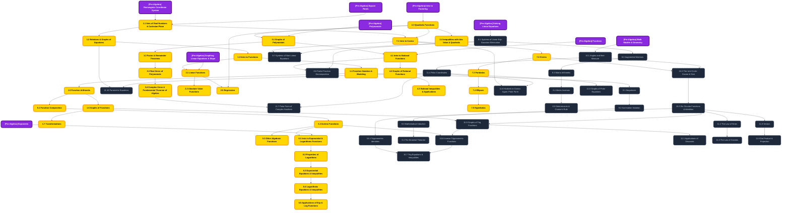

```mermaid
flowchart TD
    classDef completed fill:#FFD700,stroke:#FF8C00,stroke-width:4px,rx:10px,ry:10px,color:#000000,font-weight:bold;
    classDef incomplete fill:#1E293B,stroke:#64748B,stroke-width:3px,stroke-dasharray: 5 5,rx:10px,ry:10px,color:#CBD5E1;
    classDef prereq fill:#8A2BE2,stroke:#4B0082,stroke-width:4px,rx:10px,ry:10px,color:#FFFFFF,font-weight:bold;

    %% PREREQUISITES
    PRE_PA_COORD["[Pre-Algebra] Rectangular Coordinate System"]:::prereq
    PRE_PA_SQRT["[Pre-Algebra] Square Roots"]:::prereq
    PRE_PA_LINE["[Pre-Algebra] Graphing Linear Equations & Slope"]:::prereq
    PRE_PA_FACT["[Pre-Algebra] Intro to Factoring"]:::prereq
    PRE_PA_POLY["[Pre-Algebra] Polynomials"]:::prereq
    PRE_PA_FRAC["[Pre-Algebra] Fractions"]:::prereq
    PRE_PA_EXP["[Pre-Algebra] Exponents"]:::prereq
    PRE_PA_EQ["[Pre-Algebra] Solving Linear Equations"]:::prereq
    PRE_PA_GEOM["[Pre-Algebra] Math Models & Geometry"]:::prereq

    %% CHAPTER 1 (COMPLETED)
    C1_1[1.1 Sets of Real Numbers & Cartesian Plane]:::completed
    C1_2[1.2 Relations & Graphs of Equations]:::completed
    C1_3[1.3 Intro to Functions]:::completed
    C1_4[1.4 Function Notation & Modeling]:::completed
    C1_5[1.5 Function Arithmetic]:::completed
    C1_6[1.6 Graphs of Functions]:::completed
    C1_7[1.7 Transformations]:::completed
    PRE_PA_COORD --> C1_1
    PRE_PA_SQRT --> C1_1
    C1_1 --> C1_2 & C7_1
    C1_2 --> C1_3 & C11_10
    C1_3 --> C1_4 & C2_1
    C1_4 --> C1_5 & C9_1
    C1_5 --> C1_6 & C5_1
    C1_6 --> C1_7 & C10_5

    %% CHAPTER 2 (COMPLETED)
    C2_1[2.1 Linear Functions]:::completed
    C2_2[2.2 Absolute Value Functions]:::completed
    C2_3[2.3 Quadratic Functions]:::completed
    C2_4[2.4 Inequalities with Abs Value & Quadratic]:::completed
    C2_5[2.5 Regression]:::completed
    PRE_PA_LINE --> C2_1
    C2_1 --> C2_2 & C2_5
    PRE_PA_FACT --> C2_3
    C2_3 --> C2_4 & C2_5 & C3_1 & C7_1

    %% CHAPTER 3 (COMPLETED)
    C3_1[3.1 Graphs of Polynomials]:::completed
    C3_2[3.2 Factor & Remainder Theorems]:::completed
    C3_3[3.3 Real Zeros of Polynomials]:::completed
    C3_4[3.4 Complex Zeros & Fundamental Theorem of Algebra]:::completed
    PRE_PA_POLY --> C3_1
    C3_1 --> C3_2 & C4_1
    C3_2 --> C3_3
    C3_3 --> C3_4
    C3_4 --> C11_7

    %% CHAPTER 4 (COMPLETED)
    C4_1[4.1 Intro to Rational Functions]:::completed
    C4_2[4.2 Graphs of Rational Functions]:::completed
    C4_3[4.3 Rational Inequalities & Applications]:::completed
    PRE_PA_FRAC --> C4_1
    C4_1 --> C4_2 & C8_6
    C4_2 --> C4_3

    %% CHAPTER 5 (COMPLETED)
    C5_1[5.1 Function Composition]:::completed
    C5_2[5.2 Inverse Functions]:::completed
    C5_3[5.3 Other Algebraic Functions]:::completed
    C5_1 --> C5_2
    C5_2 --> C5_3 & C6_1 & C10_6

    %% CHAPTER 6 (COMPLETED)
    C6_1[6.1 Intro to Exponential & Logarithmic Functions]:::completed
    C6_2[6.2 Properties of Logarithms]:::completed
    C6_3[6.3 Exponential Equations & Inequalities]:::completed
    C6_4[6.4 Logarithmic Equations & Inequalities]:::completed
    C6_5[6.5 Applications of Exp & Log Functions]:::completed
    PRE_PA_EXP --> C6_1
    C6_1 --> C6_2
    C6_2 --> C6_3
    C6_3 --> C6_4
    C6_4 --> C6_5

    %% CHAPTER 7 (COMPLETED)
    C7_1[7.1 Intro to Conics]:::completed
    C7_2[7.2 Circles]:::completed
    C7_3[7.3 Parabolas]:::completed
    C7_4[7.4 Ellipses]:::completed
    C7_5[7.5 Hyperbolas]:::completed
    C7_1 --> C7_2 & C8_7 & C11_6
    C7_2 --> C7_3 & C10_2
    C7_3 --> C7_4
    C7_4 --> C7_5

    %% CHAPTER 8 (INCOMPLETE)
    C8_1[8.1 Systems of Linear Eqs: Gaussian Elimination]:::incomplete
    C8_2[8.2 Augmented Matrices]:::incomplete
    C8_3[8.3 Matrix Arithmetic]:::incomplete
    C8_4[8.4 Matrix Inverses]:::incomplete
    C8_5[8.5 Determinants & Cramer's Rule]:::incomplete
    C8_6[8.6 Partial Fraction Decomposition]:::incomplete
    C8_7[8.7 Systems of Non-Linear Equations]:::incomplete
    PRE_PA_EQ --> C8_1
    C8_1 --> C8_2 & C8_6 & C8_7
    C8_2 --> C8_3
    C8_3 --> C8_4
    C8_4 --> C8_5

    %% CHAPTER 9 (INCOMPLETE)
    C9_1[9.1 Sequences]:::incomplete
    C9_2[9.2 Summation Notation]:::incomplete
    C9_3[9.3 Mathematical Induction]:::incomplete
    C9_4[9.4 The Binomial Theorem]:::incomplete
    C9_1 --> C9_2
    C9_2 --> C9_3
    C9_3 --> C9_4

    %% CHAPTER 10 (INCOMPLETE)
    C10_1[10.1 Angles and their Measure]:::incomplete
    C10_2[10.2 The Unit Circle: Cosine & Sine]:::incomplete
    C10_3[10.3 Six Circular Functions & Identities]:::incomplete
    C10_4[10.4 Trigonometric Identities]:::incomplete
    C10_5[10.5 Graphs of Trig Functions]:::incomplete
    C10_6[10.6 Inverse Trigonometric Functions]:::incomplete
    C10_7[10.7 Trig Equations & Inequalities]:::incomplete
    PRE_PA_GEOM --> C10_1
    C10_1 --> C10_2 & C11_4
    C10_2 --> C10_3
    C10_3 --> C10_4 & C10_5 & C11_2 & C11_8
    C10_4 --> C10_7
    C10_5 --> C10_6 & C11_1
    C10_6 --> C10_7

    %% CHAPTER 11 (INCOMPLETE)
    C11_1[11.1 Applications of Sinusoids]:::incomplete
    C11_2[11.2 The Law of Sines]:::incomplete
    C11_3[11.3 The Law of Cosines]:::incomplete
    C11_4[11.4 Polar Coordinates]:::incomplete
    C11_5[11.5 Graphs of Polar Equations]:::incomplete
    C11_6[11.6 Hooked on Conics Again: Polar Form]:::incomplete
    C11_7[11.7 Polar Form of Complex Numbers]:::incomplete
    C11_8[11.8 Vectors]:::incomplete
    C11_9[11.9 Dot Product & Projection]:::incomplete
    C11_10[11.10 Parametric Equations]:::incomplete
    C11_2 --> C11_3
    C11_4 --> C11_5 & C11_6 & C11_7 & C11_10
    C11_8 --> C11_9
```