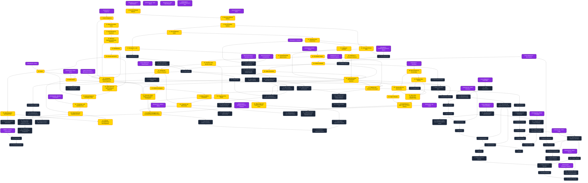

```mermaid
flowchart TD
    classDef completed fill:#FFD700,stroke:#FF8C00,stroke-width:4px,rx:10px,ry:10px,color:#000000,font-weight:bold;
    classDef incomplete fill:#1E293B,stroke:#64748B,stroke-width:3px,stroke-dasharray: 5 5,rx:10px,ry:10px,color:#CBD5E1;
    classDef prereq fill:#8A2BE2,stroke:#4B0082,stroke-width:4px,rx:10px,ry:10px,color:#FFFFFF,font-weight:bold;

    %% PREREQUISITES
    PRE_C1_1["[Precalc] 1.1 - Sets of Real Numbers"]:::prereq
    PRE_C3_4["[Precalc] 3.4 - Fundamental Theorem of Algebra"]:::prereq
    PRE_LA1_4["[Linear Algebra] 1.4 - Fields"]:::prereq
    PRE_LA1_5["[Linear Algebra] 1.5 - Vector Spaces"]:::prereq
    PRE_LA4_4["[Linear Algebra] 4.4 - Normed Spaces"]:::prereq
    PRE_LA2_1["[Linear Algebra] 2.1 - Linear Maps"]:::prereq
    PRE_LA3_4["[Linear Algebra] 3.4 - Rank and Nullity"]:::prereq
    PRE_CALC12_1["[Calculus] 12.1 - 3D Coordinate Systems"]:::prereq
    PRE_CALC11_1["[Calculus] 11.1 - Sequences"]:::prereq
    PRE_CALC11_2["[Calculus] 11.2 - Series"]:::prereq
    PRE_CALC11_6["[Calculus] 11.6 - Absolute Convergence"]:::prereq
    PRE_CALC11_8["[Calculus] 11.8 - Power Series"]:::prereq
    PRE_CALC11_10["[Calculus] 11.10 - Taylor Series"]:::prereq
    PRE_CALC2_5["[Calculus] 2.5 - Continuity"]:::prereq
    PRE_CALC2_6["[Calculus] 2.6 - Limits at Infinity"]:::prereq
    PRE_CALC2_7["[Calculus] 2.7 - Derivatives"]:::prereq
    PRE_CALC4_2["[Calculus] 4.2 - Mean Value Theorem"]:::prereq
    PRE_CALC13_2["[Calculus] 13.2 - Derivatives of Vector Functions"]:::prereq
    PRE_CALC5_2["[Calculus] 5.2 - Definite Integral"]:::prereq
    PRE_CALC5_3["[Calculus] 5.3 - Fundamental Theorem of Calc"]:::prereq
    PRE_CALC8_1["[Calculus] 8.1 - Arc Length"]:::prereq
    PRE_CALC14_3["[Calculus] 14.3 - Partial Derivatives"]:::prereq
    PRE_CALC15_9["[Calculus] 15.9 - Change of Variables"]:::prereq
    PRE_CALC16_1["[Calculus] 16.1 - Vector Fields"]:::prereq
    PRE_CALC16_8["[Calculus] 16.8 - Stokes' Theorem"]:::prereq
    PRE_CALC16_9["[Calculus] 16.9 - Divergence Theorem"]:::prereq
    PRE_HTPI1_4["[How to Prove It] 1.4 - Operations on Sets"]:::prereq
    PRE_HTPI7_2["[How to Prove It] 7.2 - Countable Sets"]:::prereq
    PRE_HTPI6_1["[How to Prove It] 6.1 - Mathematical Induction"]:::prereq
    PRE_PDE5_3["[PDE] 5.3 - General Fourier Series"]:::prereq

    %% ==========================================
    %% ELEMENTARY ANALYSIS (ROSS)
    %% ==========================================
    %% CHAPTER 1: INTRODUCTION
    ROSS_1["1 - The Set N of Natural Numbers"]
    ROSS_2["2 - The Set Q of Rational Numbers"]
    ROSS_3["3 - The Set R of Real Numbers"]
    ROSS_4["4 - The Completeness Axiom"]
    ROSS_5["5 - The Symbols +∞ and -∞"]
    ROSS_6["6 - A Development of R"]

    PRE_C1_1 --> ROSS_1
    ROSS_1 --> ROSS_2
    PRE_LA1_4 --> ROSS_2
    ROSS_2 --> ROSS_3
    ROSS_3 --> ROSS_4
    ROSS_4 --> ROSS_5
    ROSS_5 --> ROSS_6

    %% CHAPTER 2: SEQUENCES
    ROSS_7["7 - Limits of Sequences"]
    ROSS_8["8 - A Discussion about Proofs"]
    ROSS_9["9 - Limit Theorems for Sequences"]
    ROSS_10["10 - Monotone Sequences and Cauchy Sequences"]
    ROSS_11["11 - Subsequences"]
    ROSS_12["12 - lim sup's and lim inf's"]
    ROSS_13["13 - Some Topological Concepts in Metric Spaces"]
    ROSS_14["14 - Series"]
    ROSS_15["15 - Alternating Series and Integral Tests"]
    ROSS_16["16 - Decimal Expansions of Real Numbers"]

    PRE_CALC11_1 --> ROSS_7
    ROSS_7 --> ROSS_8
    ROSS_8 --> ROSS_9
    ROSS_9 --> ROSS_10
    ROSS_10 --> ROSS_11
    ROSS_11 --> ROSS_12
    ROSS_12 --> ROSS_13
    PRE_CALC11_2 --> ROSS_14
    ROSS_12 --> ROSS_14
    ROSS_14 --> ROSS_15
    ROSS_15 --> ROSS_16

    %% CHAPTER 3: CONTINUITY
    ROSS_17["17 - Continuous Functions"]
    ROSS_18["18 - Properties of Continuous Functions"]
    ROSS_19["19 - Uniform Continuity"]
    ROSS_20["20 - Limits of Functions"]
    ROSS_21["21 - More on Metric Spaces: Continuity"]
    ROSS_22["22 - More on Metric Spaces: Connectedness"]

    PRE_CALC2_5 --> ROSS_17
    ROSS_17 --> ROSS_18
    ROSS_18 --> ROSS_19
    ROSS_19 --> ROSS_20
    ROSS_20 --> ROSS_21
    ROSS_21 --> ROSS_22

    %% CHAPTER 4: SEQUENCES AND SERIES OF FUNCTIONS
    ROSS_23["23 - Power Series"]
    ROSS_24["24 - Uniform Convergence"]
    ROSS_25["25 - More on Uniform Convergence"]
    ROSS_26["26 - Differentiation and Integration of Power Series"]
    ROSS_27["27 - Weierstrass's Approximation Theorem"]

    PRE_CALC11_8 --> ROSS_23
    ROSS_14 --> ROSS_23
    ROSS_23 --> ROSS_24
    ROSS_24 --> ROSS_25
    ROSS_25 --> ROSS_26
    ROSS_26 --> ROSS_27

    %% CHAPTER 5: DIFFERENTIATION
    ROSS_28["28 - Basic Properties of the Derivative"]
    ROSS_29["29 - The Mean Value Theorem"]
    ROSS_30["30 - L'Hospital's Rule"]
    ROSS_31["31 - Taylor's Theorem"]

    PRE_CALC2_7 --> ROSS_28
    ROSS_28 --> ROSS_29
    ROSS_29 --> ROSS_30
    ROSS_30 --> ROSS_31

    %% CHAPTER 6: INTEGRATION
    ROSS_32["32 - The Riemann Integral"]
    ROSS_33["33 - Properties of the Riemann Integral"]
    ROSS_34["34 - Fundamental Theorem of Calculus"]
    ROSS_35["35 - Riemann-Stieltjes Integrals"]
    ROSS_36["36 - Improper Integrals"]

    PRE_CALC5_2 --> ROSS_32
    ROSS_32 --> ROSS_33
    ROSS_33 --> ROSS_34
    ROSS_34 --> ROSS_35
    ROSS_35 --> ROSS_36

    %% CHAPTER 7: CAPSTONE
    ROSS_37["37 - A Discussion of Exponents and Logarithms"]
    ROSS_38["38 - Continuous Nowhere-Differentiable Functions"]

    ROSS_36 --> ROSS_37
    ROSS_37 --> ROSS_38


    %% ==========================================
    %% REAL ANALYSIS (RUDIN) CHAPTER 1: THE REAL AND COMPLEX NUMBER SYSTEMS
    %% ==========================================
    RA1_1["1.1 - Introduction and Ordered Sets"]
    RA1_2["1.2 - Fields and The Real Field"]
    RA1_3["1.3 - The Extended Real Number System"]
    RA1_4["1.4 - The Complex Field"]
    RA1_5["1.5 - Euclidean Spaces"]

    ROSS_4 --> RA1_1
    ROSS_3 --> RA1_2
    RA1_1 --> RA1_2 & RA2_1
    ROSS_5 --> RA1_3
    RA1_2 --> RA1_3 & RA1_4
    PRE_C3_4 --> RA1_4
    PRE_LA1_5 --> RA1_5
    PRE_CALC12_1 --> RA1_5
    RA1_4 --> RA1_5

    %% ==========================================
    %% REAL ANALYSIS (RUDIN) CHAPTER 2: BASIC TOPOLOGY
    %% ==========================================
    RA2_1["2.1 - Finite, Countable, and Uncountable Sets"]
    RA2_2["2.2 - Metric Spaces"]
    RA2_3["2.3 - Compact Sets"]
    RA2_4["2.4 - Perfect Sets and Connected Sets"]

    PRE_HTPI1_4 --> RA2_1
    PRE_HTPI7_2 --> RA2_1
    PRE_LA4_4 --> RA2_2
    ROSS_13 --> RA2_2
    RA1_5 --> RA2_2
    RA2_2 --> RA2_3 & RA3_1 & RA4_1
    RA2_3 --> RA2_4 & RA4_2

    %% ==========================================
    %% REAL ANALYSIS (RUDIN) CHAPTER 3: NUMERICAL SEQUENCES AND SERIES
    %% ==========================================
    RA3_1["3.1 - Convergent, Subsequences, and Cauchy Sequences"]
    RA3_2["3.2 - Upper and Lower Limits and Special Sequences"]
    RA3_3["3.3 - Series and Series of Nonnegative Terms"]
    RA3_4["3.4 - The Number e and Root/Ratio Tests"]
    RA3_5["3.5 - Power Series and Summation by Parts"]
    RA3_6["3.6 - Absolute Convergence and Rearrangements"]

    PRE_HTPI6_1 --> RA3_1
    ROSS_7 --> RA3_1
    ROSS_10 --> RA3_1
    ROSS_11 --> RA3_1
    RA3_1 --> RA3_2 & RA7_1
    ROSS_12 --> RA3_2
    ROSS_14 --> RA3_3
    RA3_2 --> RA3_3
    PRE_CALC11_6 --> RA3_4
    RA3_3 --> RA3_4
    ROSS_23 --> RA3_5
    RA3_4 --> RA3_5
    ROSS_15 --> RA3_6
    RA3_5 --> RA3_6 & RA8_1

    %% ==========================================
    %% REAL ANALYSIS (RUDIN) CHAPTER 4: CONTINUITY
    %% ==========================================
    RA4_1["4.1 - Limits of Functions and Continuous Functions"]
    RA4_2["4.2 - Continuity and Compactness/Connectedness"]
    RA4_3["4.3 - Discontinuities and Monotonic Functions"]
    RA4_4["4.4 - Infinite Limits and Limits at Infinity"]

    ROSS_17 --> RA4_1
    ROSS_18 --> RA4_1
    ROSS_19 --> RA4_1
    ROSS_20 --> RA4_1
    RA4_1 --> RA4_2 & RA5_1 & RA6_1 & RA7_1
    ROSS_21 --> RA4_2
    ROSS_22 --> RA4_2
    RA4_2 --> RA4_3
    PRE_CALC2_6 --> RA4_4
    RA4_3 --> RA4_4

    %% ==========================================
    %% REAL ANALYSIS (RUDIN) CHAPTER 5: DIFFERENTIATION
    %% ==========================================
    RA5_1["5.1 - The Derivative of a Real Function"]
    RA5_2["5.2 - Mean Value Theorems and L'Hospital's Rule"]
    RA5_3["5.3 - Derivatives of Higher Order and Taylor's Theorem"]
    RA5_4["5.4 - Differentiation of Vector-valued Functions"]

    ROSS_28 --> RA5_1
    RA5_1 --> RA5_2
    ROSS_29 --> RA5_2
    ROSS_30 --> RA5_2
    ROSS_31 --> RA5_3
    RA5_2 --> RA5_3
    PRE_CALC13_2 --> RA5_4
    RA5_3 --> RA5_4

    %% ==========================================
    %% REAL ANALYSIS (RUDIN) CHAPTER 6: THE RIEMANN-STIELTJES INTEGRAL
    %% ==========================================
    RA6_1["6.1 - Definition and Existence of the Integral"]
    RA6_2["6.2 - Properties of the Integral"]
    RA6_3["6.3 - Integration and Differentiation"]
    RA6_4["6.4 - Integration of Vector-valued Functions and Rectifiable Curves"]

    ROSS_32 --> RA6_1
    ROSS_35 --> RA6_1
    RA6_1 --> RA6_2 & RA11_4
    ROSS_33 --> RA6_2
    ROSS_34 --> RA6_3
    RA6_2 --> RA6_3
    PRE_CALC8_1 --> RA6_4
    RA6_3 --> RA6_4 & RA7_2

    %% ==========================================
    %% REAL ANALYSIS (RUDIN) CHAPTER 7: SEQUENCES AND SERIES OF FUNCTIONS
    %% ==========================================
    RA7_1["7.1 - Discussion of Main Problem and Uniform Convergence"]
    RA7_2["7.2 - Uniform Convergence and Continuity/Integration/Differentiation"]
    RA7_3["7.3 - Equicontinuous Families of Functions"]
    RA7_4["7.4 - The Stone-Weierstrass Theorem"]

    ROSS_24 --> RA7_1
    RA7_1 --> RA7_2
    ROSS_25 --> RA7_2
    ROSS_26 --> RA7_2
    RA7_2 --> RA7_3 & RA8_1
    RA7_3 --> RA7_4
    ROSS_27 --> RA7_4

    %% ==========================================
    %% REAL ANALYSIS (RUDIN) CHAPTER 8: SOME SPECIAL FUNCTIONS
    %% ==========================================
    RA8_1["8.1 - Power Series, Exponential, and Logarithmic Functions"]
    RA8_2["8.2 - Trigonometric Functions and Algebraic Completeness"]
    RA8_3["8.3 - Fourier Series"]
    RA8_4["8.4 - The Gamma Function"]

    ROSS_37 --> RA8_1
    RA8_1 --> RA8_2
    PRE_PDE5_3 --> RA8_3
    RA8_2 --> RA8_3
    RA8_3 --> RA8_4

    %% ==========================================
    %% REAL ANALYSIS (RUDIN) CHAPTER 9: FUNCTIONS OF SEVERAL VARIABLES
    %% ==========================================
    RA9_1["9.1 - Linear Transformations"]
    RA9_2["9.2 - Differentiation and The Contraction Principle"]
    RA9_3["9.3 - The Inverse and Implicit Function Theorems"]
    RA9_4["9.4 - The Rank Theorem and Determinants"]
    RA9_5["9.5 - Derivatives of Higher Order and Differentiation of Integrals"]

    PRE_LA2_1 --> RA9_1
    PRE_CALC14_3 --> RA9_2
    RA9_1 --> RA9_2
    RA9_2 --> RA9_3
    PRE_LA3_4 --> RA9_4
    RA9_3 --> RA9_4
    RA9_4 --> RA9_5 & RA10_1

    %% ==========================================
    %% REAL ANALYSIS (RUDIN) CHAPTER 10: INTEGRATION OF DIFFERENTIAL FORMS
    %% ==========================================
    RA10_1["10.1 - Integration and Primitive Mappings"]
    RA10_2["10.2 - Partitions of Unity and Change of Variables"]
    RA10_3["10.3 - Differential Forms, Simplexes, and Chains"]
    RA10_4["10.4 - Stokes' Theorem"]
    RA10_5["10.5 - Closed Forms, Exact Forms, and Vector Analysis"]

    PRE_CALC15_9 --> RA10_1
    RA10_1 --> RA10_2
    PRE_CALC16_1 --> RA10_3
    RA10_2 --> RA10_3
    PRE_CALC16_8 --> RA10_4
    RA10_3 --> RA10_4
    PRE_CALC16_9 --> RA10_5
    RA10_4 --> RA10_5

    %% ==========================================
    %% REAL ANALYSIS (RUDIN) CHAPTER 11: THE LEBESGUE THEORY
    %% ==========================================
    RA11_1["11.1 - Set Functions and Construction of the Lebesgue Measure"]
    RA11_2["11.2 - Measure Spaces and Measurable Functions"]
    RA11_3["11.3 - Simple Functions and Integration"]
    RA11_4["11.4 - Comparison with Riemann Integral and Complex Functions"]
    RA11_5["11.5 - Functions of Class L^2"]

    RA2_1 --> RA11_1
    RA11_1 --> RA11_2
    RA11_2 --> RA11_3
    RA11_3 --> RA11_4
    RA11_4 --> RA11_5

    %% ==========================================
    %% CALCULUS ON MANIFOLDS (SPIVAK)
    %% ==========================================
    %% SPIVAK CHAPTER 1: FUNCTIONS ON EUCLIDEAN SPACE
    SPIVAK_1_1["1 - Norm and Inner Product"]
    SPIVAK_1_2["1 - Subsets of Euclidean Space"]
    SPIVAK_1_3["1 - Functions and Continuity"]

    RA1_5 --> SPIVAK_1_1
    SPIVAK_1_1 --> SPIVAK_1_2
    RA2_3 --> SPIVAK_1_2
    SPIVAK_1_2 --> SPIVAK_1_3
    RA4_1 --> SPIVAK_1_3

    %% SPIVAK CHAPTER 2: DIFFERENTIATION
    SPIVAK_2_1["2 - Basic Definitions"]
    SPIVAK_2_2["2 - Basic Theorems"]
    SPIVAK_2_3["2 - Partial Derivatives"]
    SPIVAK_2_4["2 - Derivatives"]
    SPIVAK_2_5["2 - Inverse Functions"]
    SPIVAK_2_6["2 - Implicit Functions"]
    SPIVAK_2_7["2 - Notation"]

    RA9_2 --> SPIVAK_2_1
    SPIVAK_1_3 --> SPIVAK_2_1
    SPIVAK_2_1 --> SPIVAK_2_2
    SPIVAK_2_2 --> SPIVAK_2_3
    PRE_CALC14_3 --> SPIVAK_2_3
    SPIVAK_2_3 --> SPIVAK_2_4
    SPIVAK_2_4 --> SPIVAK_2_5
    RA9_3 --> SPIVAK_2_5
    SPIVAK_2_5 --> SPIVAK_2_6
    RA9_3 --> SPIVAK_2_6
    SPIVAK_2_6 --> SPIVAK_2_7

    %% SPIVAK CHAPTER 3: INTEGRATION
    SPIVAK_3_1["3 - Basic Definitions"]
    SPIVAK_3_2["3 - Measure Zero and Content Zero"]
    SPIVAK_3_3["3 - Integrable Functions"]
    SPIVAK_3_4["3 - Fubini's Theorem"]
    SPIVAK_3_5["3 - Partitions of Unity"]
    SPIVAK_3_6["3 - Change of Variable"]

    RA6_1 --> SPIVAK_3_1
    SPIVAK_3_1 --> SPIVAK_3_2
    SPIVAK_3_2 --> SPIVAK_3_3
    SPIVAK_3_3 --> SPIVAK_3_4
    SPIVAK_3_4 --> SPIVAK_3_5
    RA10_2 --> SPIVAK_3_5
    SPIVAK_3_5 --> SPIVAK_3_6
    RA10_2 --> SPIVAK_3_6

    %% SPIVAK CHAPTER 4: INTEGRATION ON CHAINS
    SPIVAK_4_1["4 - Algebraic Preliminaries"]
    SPIVAK_4_2["4 - Fields and Forms"]
    SPIVAK_4_3["4 - Geometric Preliminaries"]
    SPIVAK_4_4["4 - The Fundamental Theorem of Calculus"]

    PRE_LA1_5 --> SPIVAK_4_1
    SPIVAK_4_1 --> SPIVAK_4_2
    RA10_3 --> SPIVAK_4_2
    SPIVAK_4_2 --> SPIVAK_4_3
    RA10_3 --> SPIVAK_4_3
    SPIVAK_4_3 --> SPIVAK_4_4

    %% SPIVAK CHAPTER 5: INTEGRATION ON MANIFOLDS
    SPIVAK_5_1["5 - Manifolds"]
    SPIVAK_5_2["5 - Fields and Forms on Manifolds"]
    SPIVAK_5_3["5 - Stokes' Theorem on Manifolds"]
    SPIVAK_5_4["5 - The Volume Element"]
    SPIVAK_5_5["5 - The Classical Theorems"]

    SPIVAK_2_6 --> SPIVAK_5_1
    SPIVAK_5_1 --> SPIVAK_5_2
    SPIVAK_5_2 --> SPIVAK_5_3
    SPIVAK_4_4 --> SPIVAK_5_3
    RA10_4 --> SPIVAK_5_3
    SPIVAK_5_3 --> SPIVAK_5_4
    SPIVAK_5_4 --> SPIVAK_5_5
    RA10_5 --> SPIVAK_5_5

    %% ==========================================
    %% CLASS ASSIGNMENTS
    %% ==========================================
    class ROSS_1,ROSS_2,ROSS_3,ROSS_4,ROSS_5,ROSS_7,ROSS_8,ROSS_9,ROSS_10,ROSS_11,ROSS_12,ROSS_14,ROSS_15,ROSS_17,ROSS_18,ROSS_19,ROSS_20,ROSS_23,ROSS_24,ROSS_25,ROSS_26,ROSS_28,ROSS_29,ROSS_31,ROSS_32,ROSS_33,ROSS_34 completed;
    
    class ROSS_6,ROSS_13,ROSS_16,ROSS_21,ROSS_22,ROSS_27,ROSS_30,ROSS_35,ROSS_36,ROSS_37,ROSS_38 incomplete;

    class RA1_1,RA1_2,RA1_3,RA3_1,RA3_2,RA3_3,RA3_4,RA3_5,RA3_6,RA4_1,RA5_1,RA5_2,RA5_3,RA6_1,RA6_2,RA6_3,RA7_1,RA7_2 completed;
    
    class RA1_4,RA1_5,RA2_1,RA2_2,RA2_3,RA2_4,RA4_2,RA4_3,RA4_4,RA5_4,RA6_4,RA7_3,RA7_4,RA8_1,RA8_2,RA8_3,RA8_4,RA9_1,RA9_2,RA9_3,RA9_4,RA9_5,RA10_1,RA10_2,RA10_3,RA10_4,RA10_5,RA11_1,RA11_2,RA11_3,RA11_4,RA11_5 incomplete;

    class SPIVAK_1_1,SPIVAK_1_2,SPIVAK_1_3,SPIVAK_2_1,SPIVAK_2_2,SPIVAK_2_3,SPIVAK_2_4,SPIVAK_2_5,SPIVAK_2_6,SPIVAK_2_7,SPIVAK_3_1,SPIVAK_3_2,SPIVAK_3_3,SPIVAK_3_4,SPIVAK_3_5,SPIVAK_3_6,SPIVAK_4_1,SPIVAK_4_2,SPIVAK_4_3,SPIVAK_4_4,SPIVAK_5_1,SPIVAK_5_2,SPIVAK_5_3,SPIVAK_5_4,SPIVAK_5_5 incomplete;
```