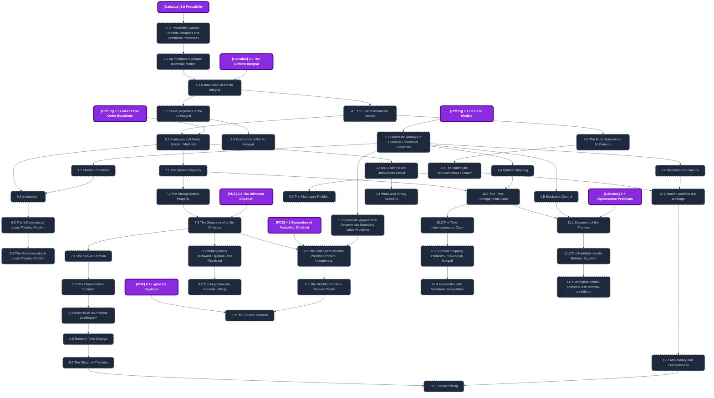

```mermaid
flowchart TD
    classDef completed fill:#FFD700,stroke:#FF8C00,stroke-width:4px,rx:10px,ry:10px,color:#000000,font-weight:bold;
    classDef incomplete fill:#1E293B,stroke:#64748B,stroke-width:3px,stroke-dasharray: 5 5,rx:10px,ry:10px,color:#CBD5E1;
    classDef prereq fill:#8A2BE2,stroke:#4B0082,stroke-width:4px,rx:10px,ry:10px,color:#FFFFFF,font-weight:bold;

    %% PREREQUISITES
    PRE_DE1_1["[Diff Eq] 1.1 DEs and Models"]:::prereq
    PRE_DE1_5["[Diff Eq] 1.5 Linear First-Order Equations"]:::prereq
    PRE_CALC8_5["[Calculus] 8.5 Probability"]:::prereq
    PRE_CALC5_2["[Calculus] 5.2 The Definite Integral"]:::prereq
    PRE_CALC4_7["[Calculus] 4.7 Optimization Problems"]:::prereq
    PRE_PDE2_3["[PDE] 2.3 The Diffusion Equation"]:::prereq
    PRE_PDE4_1["[PDE] 4.1 Separation of Variables, Dirichlet"]:::prereq
    PRE_PDE6_1["[PDE] 6.1 Laplace's Equation"]:::prereq

    %% SDE CHAPTER 1
    SDE1_1[1.1 Stochastic Analogs of Classical Differential Equations]:::incomplete
    SDE1_2[1.2 Filtering Problems]:::incomplete
    SDE1_3[1.3 Stochastic Approach to Deterministic Boundary Value Problems]:::incomplete
    SDE1_4[1.4 Optimal Stopping]:::incomplete
    SDE1_5[1.5 Stochastic Control]:::incomplete
    SDE1_6[1.6 Mathematical Finance]:::incomplete
    PRE_DE1_1 --> SDE1_1
    SDE1_1 --> SDE1_2 & SDE1_3 & SDE1_4 & SDE1_5 & SDE1_6

    %% SDE CHAPTER 2
    SDE2_1[2.1 Probability Spaces, Random Variables and Stochastic Processes]:::incomplete
    SDE2_2[2.2 An Important Example: Brownian Motion]:::incomplete
    PRE_CALC8_5 --> SDE2_1
    SDE2_1 --> SDE2_2

    %% SDE CHAPTER 3
    SDE3_1[3.1 Construction of the Ito Integral]:::incomplete
    SDE3_2[3.2 Some properties of the Ito integral]:::incomplete
    SDE3_3[3.3 Extensions of the Ito integral]:::incomplete
    SDE2_2 --> SDE3_1
    PRE_CALC5_2 --> SDE3_1
    SDE3_1 --> SDE3_2 & SDE4_1
    SDE3_2 --> SDE3_3

    %% SDE CHAPTER 4
    SDE4_1[4.1 The 1-dimensional Ito formula]:::incomplete
    SDE4_2[4.2 The Multi-dimensional Ito Formula]:::incomplete
    SDE4_3[4.3 The Martingale Representation Theorem]:::incomplete
    SDE4_1 --> SDE4_2 & SDE5_1
    SDE4_2 --> SDE4_3
    SDE4_3 --> SDE8_3 & SDE12_1

    %% SDE CHAPTER 5
    SDE5_1[5.1 Examples and Some Solution Methods]:::incomplete
    SDE5_2[5.2 An Existence and Uniqueness Result]:::incomplete
    SDE5_3[5.3 Weak and Strong Solutions]:::incomplete
    PRE_DE1_5 --> SDE5_1
    SDE5_1 --> SDE5_2 & SDE6_1 & SDE7_1
    SDE5_2 --> SDE5_3

    %% SDE CHAPTER 6
    SDE6_1[6.1 Introduction]:::incomplete
    SDE6_2[6.2 The 1-Dimensional Linear Filtering Problem]:::incomplete
    SDE6_3[6.3 The Multidimensional Linear Filtering Problem]:::incomplete
    SDE1_2 --> SDE6_1
    SDE6_1 --> SDE6_2
    SDE6_2 --> SDE6_3

    %% SDE CHAPTER 7
    SDE7_1[7.1 The Markov Property]:::incomplete
    SDE7_2[7.2 The Strong Markov Property]:::incomplete
    SDE7_3[7.3 The Generator of an Ito Diffusion]:::incomplete
    SDE7_4[7.4 The Dynkin Formula]:::incomplete
    SDE7_5[7.5 The Characteristic Operator]:::incomplete
    SDE7_1 --> SDE7_2 & SDE10_1
    SDE7_2 --> SDE7_3
    PRE_PDE2_3 --> SDE7_3
    SDE7_3 --> SDE7_4 & SDE8_1 & SDE9_1
    SDE7_4 --> SDE7_5
    SDE7_5 --> SDE8_4

    %% SDE CHAPTER 8
    SDE8_1[8.1 Kolmogorov's Backward Equation. The Resolvent]:::incomplete
    SDE8_2[8.2 The Feynman-Kac Formula. Killing]:::incomplete
    SDE8_3[8.3 The Martingale Problem]:::incomplete
    SDE8_4[8.4 When is an Ito Process a Diffusion?]:::incomplete
    SDE8_5[8.5 Random Time Change]:::incomplete
    SDE8_6[8.6 The Girsanov Theorem]:::incomplete
    SDE8_1 --> SDE8_2
    SDE8_4 --> SDE8_5
    SDE8_5 --> SDE8_6
    SDE8_6 --> SDE12_3

    %% SDE CHAPTER 9
    SDE9_1[9.1 The Combined Dirichlet-Poisson Problem. Uniqueness]:::incomplete
    SDE9_2[9.2 The Dirichlet Problem. Regular Points]:::incomplete
    SDE9_3[9.3 The Poisson Problem]:::incomplete
    PRE_PDE4_1 --> SDE9_1
    SDE1_3 --> SDE9_1
    SDE9_1 --> SDE9_2
    PRE_PDE6_1 --> SDE9_3
    SDE9_2 --> SDE9_3

    %% SDE CHAPTER 10
    SDE10_1[10.1 The Time-Homogeneous Case]:::incomplete
    SDE10_2[10.2 The Time-Inhomogeneous Case]:::incomplete
    SDE10_3[10.3 Optimal Stopping Problems Involving an Integral]:::incomplete
    SDE10_4[10.4 Connection with Variational Inequalities]:::incomplete
    SDE1_4 --> SDE10_1
    SDE10_1 --> SDE10_2 & SDE11_1
    SDE10_2 --> SDE10_3
    SDE10_3 --> SDE10_4

    %% SDE CHAPTER 11
    SDE11_1[11.1 Statement of the Problem]:::incomplete
    SDE11_2[11.2 The Hamilton-Jacobi-Bellman Equation]:::incomplete
    SDE11_3[11.3 Stochastic control problems with terminal conditions]:::incomplete
    SDE1_5 --> SDE11_1
    PRE_CALC4_7 --> SDE11_1
    SDE11_1 --> SDE11_2
    SDE11_2 --> SDE11_3

    %% SDE CHAPTER 12
    SDE12_1[12.1 Market, portfolio and arbitrage]:::incomplete
    SDE12_2[12.2 Attainability and Completeness]:::incomplete
    SDE12_3[12.3 Option Pricing]:::incomplete
    SDE1_6 --> SDE12_1
    SDE12_1 --> SDE12_2
    SDE12_2 --> SDE12_3
```