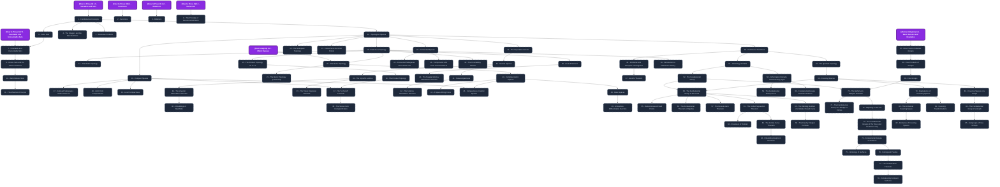

```mermaid
flowchart TD
    classDef completed fill:#FFD700,stroke:#FF8C00,stroke-width:4px,rx:10px,ry:10px,color:#000000,font-weight:bold;
    classDef incomplete fill:#1E293B,stroke:#64748B,stroke-width:3px,stroke-dasharray: 5 5,rx:10px,ry:10px,color:#CBD5E1;
    classDef prereq fill:#8A2BE2,stroke:#4B0082,stroke-width:4px,rx:10px,ry:10px,color:#FFFFFF,font-weight:bold;

    %% PREREQUISITES
    PRE_HTPI1_3["[How to Prove It] 1.3 - Variables and Sets"]:::prereq
    PRE_HTPI4_2["[How to Prove It] 4.2 - Relations"]:::prereq
    PRE_HTPI5_1["[How to Prove It] 5.1 - Functions"]:::prereq
    PRE_HTPI6_3["[How to Prove It] 6.3 - Recursion"]:::prereq
    PRE_HTPI7_2["[How to Prove It] 7.2 - Countable and Uncountable Sets"]:::prereq
    PRE_RA2_2["[Real Analysis] 2.2 - Metric Spaces"]:::prereq
    PRE_AA1_1["[Abstract Algebra] 1.1 - Basic Axioms and Examples"]:::prereq

    %% ==========================================
    %% TOPOLOGY (MUNKRES)
    %% ==========================================

    %% CHAPTER 1: SET THEORY AND LOGIC
    TOP_1["1 - Fundamental Concepts"]:::incomplete
    TOP_2["2 - Functions"]:::incomplete
    TOP_3["3 - Relations"]:::incomplete
    TOP_4["4 - The Integers and the Real Numbers"]:::incomplete
    TOP_5["5 - Cartesian Products"]:::incomplete
    TOP_6["6 - Finite Sets"]:::incomplete
    TOP_7["7 - Countable and Uncountable Sets"]:::incomplete
    TOP_8["8 - The Principle of Recursive Definition"]:::incomplete
    TOP_9["9 - Infinite Sets and the Axiom of Choice"]:::incomplete
    TOP_10["10 - Well-Ordered Sets"]:::incomplete
    TOP_11["11 - The Maximum Principle"]:::incomplete

    PRE_HTPI1_3 --> TOP_1
    PRE_HTPI5_1 --> TOP_2
    PRE_HTPI4_2 --> TOP_3
    TOP_1 --> TOP_4
    TOP_1 --> TOP_5
    TOP_1 --> TOP_6
    PRE_HTPI7_2 --> TOP_7
    TOP_6 --> TOP_7
    PRE_HTPI6_3 --> TOP_8
    TOP_7 --> TOP_9
    TOP_9 --> TOP_10
    TOP_10 --> TOP_11

    %% CHAPTER 2: TOPOLOGICAL SPACES AND CONTINUOUS FUNCTIONS
    TOP_12["12 - Topological Spaces"]:::incomplete
    TOP_13["13 - Basis for a Topology"]:::incomplete
    TOP_14["14 - The Order Topology"]:::incomplete
    TOP_15["15 - The Product Topology on X x Y"]:::incomplete
    TOP_16["16 - The Subspace Topology"]:::incomplete
    TOP_17["17 - Closed Sets and Limit Points"]:::incomplete
    TOP_18["18 - Continuous Functions"]:::incomplete
    TOP_19["19 - The Product Topology"]:::incomplete
    TOP_20["20 - The Metric Topology"]:::incomplete
    TOP_21["21 - The Metric Topology (continued)"]:::incomplete
    TOP_22["22 - The Quotient Topology"]:::incomplete

    TOP_1 --> TOP_12
    TOP_12 --> TOP_13
    TOP_13 --> TOP_14
    TOP_13 --> TOP_15
    TOP_12 --> TOP_16
    TOP_12 --> TOP_17
    TOP_12 --> TOP_18
    TOP_15 --> TOP_19
    PRE_RA2_2 --> TOP_20
    TOP_13 --> TOP_20
    TOP_20 --> TOP_21
    TOP_18 --> TOP_22

    %% CHAPTER 3: CONNECTEDNESS AND COMPACTNESS
    TOP_23["23 - Connected Spaces"]:::incomplete
    TOP_24["24 - Connected Subspaces of the Real Line"]:::incomplete
    TOP_25["25 - Components and Local Connectedness"]:::incomplete
    TOP_26["26 - Compact Spaces"]:::incomplete
    TOP_27["27 - Compact Subspaces of the Real Line"]:::incomplete
    TOP_28["28 - Limit Point Compactness"]:::incomplete
    TOP_29["29 - Local Compactness"]:::incomplete

    TOP_12 --> TOP_23
    TOP_23 --> TOP_24
    TOP_23 --> TOP_25
    TOP_12 --> TOP_26
    TOP_26 --> TOP_27
    TOP_26 --> TOP_28
    TOP_26 --> TOP_29

    %% CHAPTER 4: COUNTABILITY AND SEPARATION AXIOMS
    TOP_30["30 - The Countability Axioms"]:::incomplete
    TOP_31["31 - The Separation Axioms"]:::incomplete
    TOP_32["32 - Normal Spaces"]:::incomplete
    TOP_33["33 - The Urysohn Lemma"]:::incomplete
    TOP_34["34 - The Urysohn Metrization Theorem"]:::incomplete
    TOP_35["35 - The Tietze Extension Theorem"]:::incomplete
    TOP_36["36 - Imbeddings of Manifolds"]:::incomplete

    TOP_13 --> TOP_30
    TOP_12 --> TOP_31
    TOP_31 --> TOP_32
    TOP_32 --> TOP_33
    TOP_33 --> TOP_34
    TOP_33 --> TOP_35
    TOP_34 --> TOP_36

    %% CHAPTER 5: THE TYCHONOFF THEOREM
    TOP_37["37 - The Tychonoff Theorem"]:::incomplete
    TOP_38["38 - The Stone-Cech Compactification"]:::incomplete

    TOP_26 --> TOP_37
    TOP_19 --> TOP_37
    TOP_37 --> TOP_38

    %% CHAPTER 6: METRIZATION THEOREMS AND PARACOMPACTNESS
    TOP_39["39 - Local Finiteness"]:::incomplete
    TOP_40["40 - The Nagata-Smirnov Metrization Theorem"]:::incomplete
    TOP_41["41 - Paracompactness"]:::incomplete
    TOP_42["42 - The Smirnov Metrization Theorem"]:::incomplete

    TOP_13 --> TOP_39
    TOP_39 --> TOP_40
    TOP_32 --> TOP_41
    TOP_41 --> TOP_42

    %% CHAPTER 7: COMPLETE METRIC SPACES AND FUNCTION SPACES
    TOP_43["43 - Complete Metric Spaces"]:::incomplete
    TOP_44["44 - A Space-Filling Curve"]:::incomplete
    TOP_45["45 - Compactness in Metric Spaces"]:::incomplete
    TOP_46["46 - Pointwise and Compact Convergence"]:::incomplete
    TOP_47["47 - Ascoli's Theorem"]:::incomplete

    TOP_20 --> TOP_43
    TOP_43 --> TOP_44
    TOP_26 --> TOP_45
    TOP_43 --> TOP_45
    TOP_18 --> TOP_46
    TOP_46 --> TOP_47

    %% CHAPTER 8: BAIRE SPACES AND DIMENSION THEORY
    TOP_48["48 - Baire Spaces"]:::incomplete
    TOP_49["49 - A Nowhere-Differentiable Function"]:::incomplete
    TOP_50["50 - Introduction to Dimension Theory"]:::incomplete

    TOP_43 --> TOP_48
    TOP_48 --> TOP_49
    TOP_13 --> TOP_50

    %% CHAPTER 9: THE FUNDAMENTAL GROUP
    TOP_51["51 - Homotopy of Paths"]:::incomplete
    TOP_52["52 - The Fundamental Group"]:::incomplete
    TOP_53["53 - Covering Spaces"]:::incomplete
    TOP_54["54 - The Fundamental Group of the Circle"]:::incomplete
    TOP_55["55 - Retractions and Fixed Points"]:::incomplete
    TOP_56["56 - The Fundamental Theorem of Algebra"]:::incomplete
    TOP_57["57 - The Borsuk-Ulam Theorem"]:::incomplete
    TOP_58["58 - Deformation Retracts and Homotopy Type"]:::incomplete
    TOP_59["59 - The Fundamental Group of S^n"]:::incomplete
    TOP_60["60 - Fundamental Groups of Some Surfaces"]:::incomplete

    TOP_18 --> TOP_51
    TOP_51 --> TOP_52
    TOP_22 --> TOP_53
    TOP_52 --> TOP_54
    TOP_53 --> TOP_54
    TOP_54 --> TOP_55
    TOP_54 --> TOP_56
    TOP_54 --> TOP_57
    TOP_51 --> TOP_58
    TOP_58 --> TOP_59
    TOP_58 --> TOP_60

    %% CHAPTER 10: SEPARATION THEOREMS IN THE PLANE
    TOP_61["61 - The Jordan Separation Theorem"]:::incomplete
    TOP_62["62 - Invariance of Domain"]:::incomplete
    TOP_63["63 - The Jordan Curve Theorem"]:::incomplete
    TOP_64["64 - Imbedding Graphs in the Plane"]:::incomplete
    TOP_65["65 - The Winding Number of a Simple Closed Curve"]:::incomplete
    TOP_66["66 - The Cauchy Integral Formula"]:::incomplete

    TOP_54 --> TOP_61
    TOP_61 --> TOP_62
    TOP_61 --> TOP_63
    TOP_63 --> TOP_64
    TOP_54 --> TOP_65
    TOP_65 --> TOP_66

    %% CHAPTER 11: THE SEIFERT-VAN KAMPEN THEOREM
    TOP_67["67 - Direct Sums of Abelian Groups"]:::incomplete
    TOP_68["68 - Free Products of Groups"]:::incomplete
    TOP_69["69 - Free Groups"]:::incomplete
    TOP_70["70 - The Seifert-van Kampen Theorem"]:::incomplete
    TOP_71["71 - The Fundamental Group of a Wedge of Circles"]:::incomplete
    TOP_72["72 - Adjoining a Two-cell"]:::incomplete
    TOP_73["73 - The Fundamental Groups of the Torus and the Dunce Cap"]:::incomplete

    PRE_AA1_1 --> TOP_67
    TOP_67 --> TOP_68
    TOP_68 --> TOP_69
    TOP_52 --> TOP_70
    TOP_69 --> TOP_70
    TOP_70 --> TOP_71
    TOP_70 --> TOP_72
    TOP_72 --> TOP_73

    %% CHAPTER 12: CLASSIFICATION OF SURFACES
    TOP_74["74 - Fundamental Groups of Surfaces"]:::incomplete
    TOP_75["75 - Homology of Surfaces"]:::incomplete
    TOP_76["76 - Cutting and Pasting"]:::incomplete
    TOP_77["77 - The Classification Theorem"]:::incomplete
    TOP_78["78 - Constructing Compact Surfaces"]:::incomplete

    TOP_73 --> TOP_74
    TOP_74 --> TOP_75
    TOP_74 --> TOP_76
    TOP_76 --> TOP_77
    TOP_77 --> TOP_78

    %% CHAPTER 13: CLASSIFICATION OF COVERING SPACES
    TOP_79["79 - Equivalence of Covering Spaces"]:::incomplete
    TOP_80["80 - The Universal Covering Space"]:::incomplete
    TOP_81["81 - Covering Transformations"]:::incomplete
    TOP_82["82 - Existence of Covering Spaces"]:::incomplete

    TOP_53 --> TOP_79
    TOP_79 --> TOP_80
    TOP_79 --> TOP_81
    TOP_80 --> TOP_82

    %% CHAPTER 14: APPLICATIONS TO GROUP THEORY
    TOP_83["83 - Covering Spaces of a Graph"]:::incomplete
    TOP_84["84 - The Fundamental Group of a Graph"]:::incomplete
    TOP_85["85 - Subgroups of Free Groups"]:::incomplete

    TOP_53 --> TOP_83
    TOP_83 --> TOP_84
    TOP_84 --> TOP_85
```